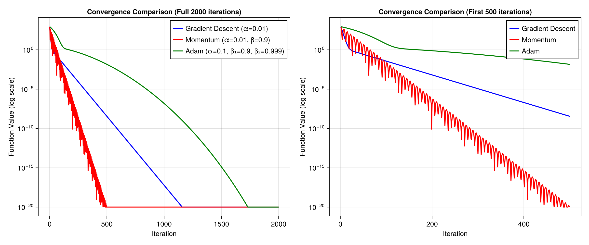
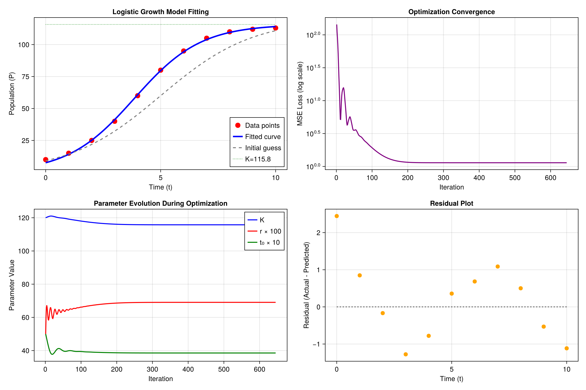

# Homework 11 - Gradient-Based Optimization

**Author:** Mingxu Zhang - 50046133
**Date:** November 27, 2025

---

## Problem 1: Gradient Descent Implementation on Himmelblau's Function

### 1.1 Problem Description

Implement gradient descent from scratch and test it on Himmelblau's function:

$$f(x, y) = (x^2 + y - 11)^2 + (x + y^2 - 7)^2$$

This function has four global minima, all with function value $f = 0$.

### 1.2 Implementation

The gradient descent algorithm was implemented from scratch using `ForwardDiff.jl` for automatic gradient computation. The algorithm:

```julia
function gradient_descent(f, x0; learning_rate=0.01, max_iter=1000, tol=1e-8)
    x = copy(x0)
    for i in 1:max_iter
        grad = ForwardDiff.gradient(f, x)
        if norm(grad) < tol
            break
        end
        x = x - learning_rate * grad
    end
    return x
end
```

**Key parameters:**
- Learning rate: $\alpha = 0.01$
- Maximum iterations: 5000
- Convergence tolerance: $10^{-8}$

### 1.3 Results

The algorithm was tested from 8 different starting points:

| Starting Point | Final Point | f(x,y) | Iterations |
|----------------|-------------|--------|------------|
| (0.0, 0.0) | (3.0, 2.0) | 0.0 | 78 |
| (5.0, 5.0) | (3.0, 2.0) | 0.0 | 84 |
| (-5.0, 5.0) | (-2.8051, 3.1313) | 0.0 | 27 |
| (5.0, -5.0) | (3.5844, -1.8481) | 0.0 | 76 |
| (-5.0, -5.0) | (-3.7793, -3.2832) | 0.0 | 22 |
| (1.0, 1.0) | (3.0, 2.0) | 0.0 | 72 |
| (-4.0, -4.0) | (-3.7793, -3.2832) | 0.0 | 22 |
| (4.0, -2.0) | (3.5844, -1.8481) | 0.0 | 60 |

**Known global minima of Himmelblau's function:**
- $(3, 2)$
- $(-2.805118, 3.131312)$
- $(-3.779310, -3.283186)$
- $(3.584428, -1.848126)$

All four minima were successfully found from different starting points.

### 1.4 Convergence Plot


The plot shows:
- **Top:** Convergence curves (function value vs iteration) on log scale for all starting points
- **Bottom:** Contour plot of Himmelblau's function with starting points (circles), final points (diamonds), and known minima (stars)

### 1.5 Observations

1. The gradient descent algorithm successfully converges to global minima from all tested starting points
2. Different starting points lead to different minima depending on which basin of attraction they fall into
3. Convergence is fast, typically within 100 iterations with the chosen learning rate

---

## Problem 2: Optimizer Comparison

### 2.1 Problem Description

Compare three optimization methods on the Booth function:

$$f(x, y) = (x + 2y - 7)^2 + (2x + y - 5)^2$$

The global minimum is at $(1, 3)$ with $f = 0$.

### 2.2 Optimizers Implemented

1. **Gradient Descent:** $x_{t+1} = x_t - \alpha \nabla f(x_t)$
   - Learning rate: $\alpha = 0.01$

2. **Momentum:** 
   - $v_{t+1} = \beta v_t + \alpha \nabla f(x_t)$
   - $x_{t+1} = x_t - v_{t+1}$
   - Parameters: $\alpha = 0.01$, $\beta = 0.9$

3. **Adam:**
   - $m_t = \beta_1 m_{t-1} + (1-\beta_1) g_t$
   - $v_t = \beta_2 v_{t-1} + (1-\beta_2) g_t^2$
   - $\hat{m}_t = m_t / (1-\beta_1^t)$
   - $\hat{v}_t = v_t / (1-\beta_2^t)$
   - $x_{t+1} = x_t - \alpha \hat{m}_t / (\sqrt{\hat{v}_t} + \epsilon)$
   - Parameters: $\alpha = 0.1$, $\beta_1 = 0.9$, $\beta_2 = 0.999$

### 2.3 Results

**Starting point:** $(-5, -5)$  
**Iterations:** 2000

| Method | Final Point | Final f(x,y) | Convergence Iteration* |
|--------|-------------|--------------|------------------------|
| Gradient Descent | (1.0, 3.0) | 0.0 | 361 |
| Momentum | (1.0, 3.0) | 0.0 | **156** |
| Adam | (1.0, 3.0) | 0.0 | 934 |

*Iteration where $f < 10^{-6}$

### 2.4 Convergence Plot



### 2.5 Analysis

**Winner: Momentum** converged fastest to the optimum.

- **Momentum** achieved the fastest convergence (156 iterations) by accumulating velocity in the direction of consistent gradients, which helps escape shallow regions faster.
  
- **Gradient Descent** performed well (361 iterations), converging at a steady rate determined by the learning rate.

- **Adam** was surprisingly slower (934 iterations) in this case. This is because:
  1. The learning rate for Adam was set to 0.1 (higher than GD), but Adam's adaptive learning rate scales down quickly
  2. For simple quadratic functions like Booth, Adam's adaptive mechanism may not provide advantages
  3. The bias correction in early iterations slows down the effective step size

**Note:** Adam typically excels in high-dimensional, non-convex optimization (like neural network training), but may not always be the fastest for simple convex functions.

---

## Problem 3: Parameter Fitting with Logistic Growth Model

### 3.1 Problem Description

Fit a logistic growth model to population data:

$$P(t) = \frac{K}{1 + e^{-r(t-t_0)}}$$

Where:
- $K$: carrying capacity
- $r$: growth rate
- $t_0$: inflection point

### 3.2 Data

| t | 0 | 1 | 2 | 3 | 4 | 5 | 6 | 7 | 8 | 9 | 10 |
|---|---|---|---|---|---|---|---|---|---|---|---|
| P | 10 | 15 | 25 | 40 | 60 | 80 | 95 | 105 | 110 | 112 | 113 |

### 3.3 Optimization Setup

**Loss Function (Mean Squared Error):**
$$L(K, r, t_0) = \frac{1}{n}\sum_{i=1}^n (P_i - P(t_i))^2$$

**Initial Parameters:**
- $K_0 = 120$
- $r_0 = 0.5$
- $t_{0,init} = 5.0$
- Initial MSE: 143.89

**Adam Optimizer Settings:**
- $\alpha = 0.1$
- $\beta_1 = 0.9$
- $\beta_2 = 0.999$
- Maximum iterations: 10000

### 3.4 Results

**Optimal Parameters (converged at iteration 645):**

| Parameter | Initial | Optimal | Interpretation |
|-----------|---------|---------|----------------|
| K | 120.0 | **115.75** | Carrying capacity (max population) |
| r | 0.5 | **0.6906** | Growth rate |
| t₀ | 5.0 | **3.8546** | Inflection point (fastest growth) |

**Model Performance:**
- **Final MSE:** 1.138
- **R² (Coefficient of Determination):** 0.9993 (99.93% of variance explained)

### 3.5 Fitted Model

$$P(t) = \frac{115.75}{1 + e^{-0.6906(t - 3.85)}}$$

### 3.6 Predictions vs Actual

| t | Actual | Predicted | Error |
|---|--------|-----------|-------|
| 0 | 10.0 | 7.55 | 2.45 |
| 1 | 15.0 | 14.15 | 0.85 |
| 2 | 25.0 | 25.17 | -0.17 |
| 3 | 40.0 | 41.28 | -1.28 |
| 4 | 60.0 | 60.78 | -0.78 |
| 5 | 80.0 | 79.64 | 0.36 |
| 6 | 95.0 | 94.32 | 0.68 |
| 7 | 105.0 | 103.91 | 1.09 |
| 8 | 110.0 | 109.50 | 0.50 |
| 9 | 112.0 | 112.53 | -0.53 |
| 10 | 113.0 | 114.12 | -1.12 |

### 3.7 Visualization



The figure shows:
1. **Top Left:** Data points with fitted curve and initial guess
2. **Top Right:** MSE loss convergence during optimization
3. **Bottom Left:** Parameter evolution during optimization
4. **Bottom Right:** Residual plot showing prediction errors

### 3.8 Interpretation

The fitted logistic model captures the population growth dynamics very well:

1. **Carrying Capacity (K = 115.75):** The population will stabilize around 116 individuals
2. **Growth Rate (r = 0.69):** Moderate growth rate indicating healthy expansion
3. **Inflection Point (t₀ = 3.85):** Fastest growth occurs around t = 4, after which growth slows due to resource limitations

This type of model is commonly used in:
- **Biology:** Population dynamics, species growth
- **Epidemiology:** Disease spread modeling
- **Technology adoption:** S-curve adoption patterns
- **Business:** Market saturation analysis

---

## Code Files

1. `problem1_gradient_descent.jl` - Gradient descent implementation
2. `problem2_optimizer_comparison.jl` - Optimizer comparison
3. `problem3_parameter_fitting.jl` - Logistic growth model fitting

## Dependencies

```julia
using ForwardDiff  # Automatic differentiation
using CairoMakie   # Visualization
```
