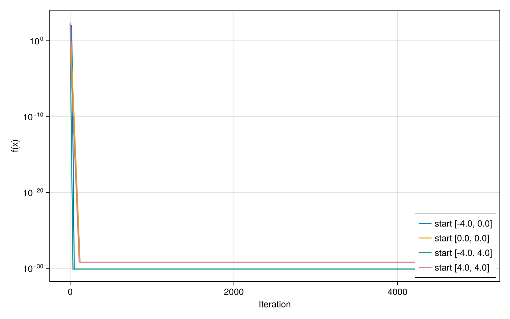
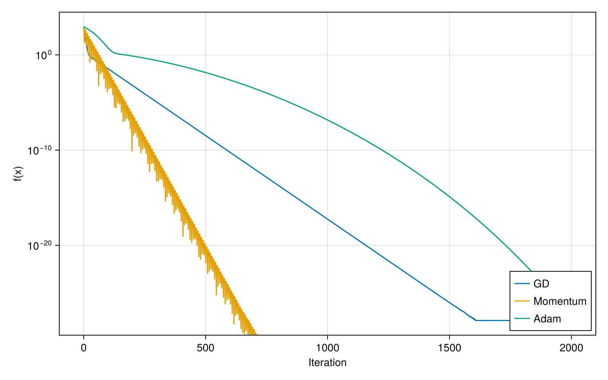
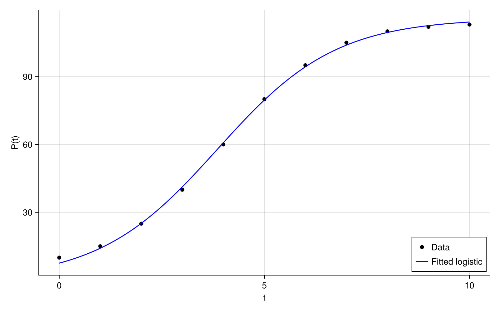

# Homework 11

## 1. Gradient Descent on Himmelblau's Function

I implemented gradient descent from scratch with gradients from `ForwardDiff.jl`. I tested four starting points and used a constant learning rate. All runs converged to known global minima with function value near 0.

**Results (α = 0.01, 5000 iterations):**
- start = [-4.0, 0.0], final = [-3.779310253377747, -3.283185991286169], f = 7.888609052210118e-31
- start = [0.0, 0.0], final = [2.9999999999999996, 2.0000000000000004], f = 6.310887241768095e-30
- start = [-4.0, 4.0], final = [-2.805118086952745, 3.131312518250573], f = 7.888609052210118e-31
- start = [4.0, 4.0], final = [2.9999999999999996, 2.0000000000000004], f = 6.310887241768095e-30

Convergence plot:

## 2. Booth Function: GD vs Momentum vs Adam

I compared three optimizers starting from (-5, -5) for 2000 iterations and used the given hyperparameters. All methods reached the global minimum (1, 3). Momentum converged the fastest in terms of reduction in function value across iterations.

**Results (2000 iterations):**
- GD final = [1.000000000000008, 2.9999999999999916], f = 1.2937318845624594e-28
- Momentum final = [1.0, 3.0], f = 0.0
- Adam final = [1.0000000000000109, 2.9999999999999885], f = 2.68212707775144e-28

Convergence comparison:

## 3. Logistic Growth Parameter Fitting (Adam)

I fit the logistic model with Adam using MSE loss. I initialized parameters at K=120, r=0.5, t0=5, used a learning rate of 0.05, and enforced K>0, r>0 by clamping during updates. The fitted curve matches the trend of the data well.

**Fitted parameters:**
- K = 115.75345962819733
- r = 0.6905336128962739
- t0 = 3.8546379817468686
- final loss = 1.1384578357727435

Fitted curve:

