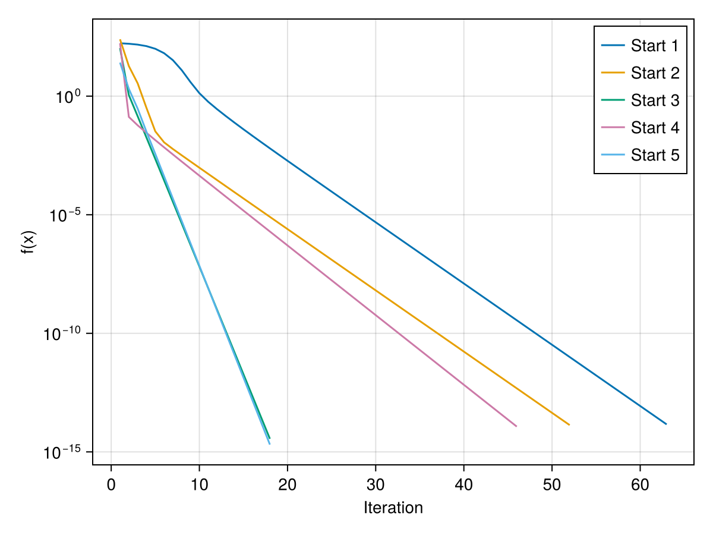
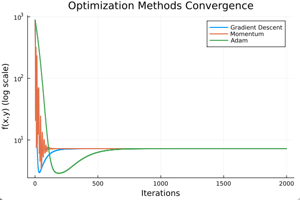
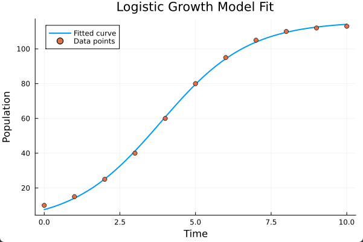

# Q1



```julia
using ForwardDiff, CairoMakie, LinearAlgebra

# Himmelblau function
himmelblau(x) = (x[1]^2 + x[2] - 11)^2 + (x[1] + x[2]^2 - 7)^2

# Gradient descent implementation
function gradient_descent(f, x0; lr=0.01, max_iters=1000, tol=1e-8)
    x, history = copy(x0), Float64[]
    for i in 1:max_iters
        grad = ForwardDiff.gradient(f, x)
        x_new = x - lr * grad
        f_val = f(x)
        push!(history, f_val)
        norm(x_new - x) < tol && f_val < tol && break
        x = x_new
    end
    return x, history
end

# Test points and known minima
test_points = [[0,0], [4,4], [-4,4], [4,-4], [-4,-4]]
minima = [[3.0,2.0], [-2.805118,3.131312], [-3.779310,-3.283186], [3.584428,-1.848126]]

# Run optimization
results = []
for x0 in test_points
    x_opt, hist = gradient_descent(himmelblau, x0; lr=0.01)
    push!(results, (x0, x_opt, himmelblau(x_opt), hist))
    println("Start: $x0 → Opt: $x_opt, f=$(himmelblau(x_opt))")
end

# Convergence plot
fig = Figure()
ax = Axis(fig[1,1], xlabel="Iteration", ylabel="f(x)", yscale=log10)
for (i,res) in enumerate(results)
    lines!(ax, res[4], label="Start $i")
end
axislegend(ax)
save("D://juliahw//hw11//q1.png", fig)
```


# Q2

```julia
using Plots

# Booth function and gradient
f(x, y) = (x + 2y - 7)^2 + (2x + y - 5)^2
∇f(x, y) = [10x + 8y - 24, 8x + 10y - 34]

# Optimization methods
function gradient_descent(x0, y0, α, iterations)
    x, y = x0, y0
    history = Float64[]
    for i in 1:iterations
        push!(history, f(x, y))
        g = ∇f(x, y)
        x -= α * g[1]
        y -= α * g[2]
    end
    return history
end

function momentum(x0, y0, α, β, iterations)
    x, y = x0, y0
    vx, vy = 0.0, 0.0
    history = Float64[]
    for i in 1:iterations
        push!(history, f(x, y))
        g = ∇f(x, y)
        vx = β * vx + α * g[1]
        vy = β * vy + α * g[2]
        x -= vx
        y -= vy
    end
    return history
end

function adam(x0, y0, α, β1, β2, ϵ=1e-8, iterations=2000)
    x, y = x0, y0
    m, v = [0.0, 0.0], [0.0, 0.0]
    history = Float64[]
    for t in 1:iterations
        push!(history, f(x, y))
        g = ∇f(x, y)
        m = β1 .* m + (1 - β1) .* g
        v = β2 .* v + (1 - β2) .* g.^2
        m̂ = m ./ (1 - β1^t)
        v̂ = v ./ (1 - β2^t)
        update = α .* m̂ ./ (sqrt.(v̂) .+ ϵ)
        x -= update[1]
        y -= update[2]
    end
    return history
end

# Run optimizations
x0, y0 = -5.0, -5.0
iterations = 2000

gd_history = gradient_descent(x0, y0, 0.01, iterations)
mom_history = momentum(x0, y0, 0.01, 0.9, iterations)
adam_history = adam(x0, y0, 0.1, 0.9, 0.999, 1e-8, iterations)

# Plot convergence diagram
plot(1:iterations, [gd_history mom_history adam_history], 
     label=["Gradient Descent" "Momentum" "Adam"], 
     yscale=:log10, linewidth=2,
     xlabel="Iterations", ylabel="f(x,y) (log scale)",
     title="Optimization Methods Convergence",
     legend=:topright)
```



Adam is the fastest


# Q3



