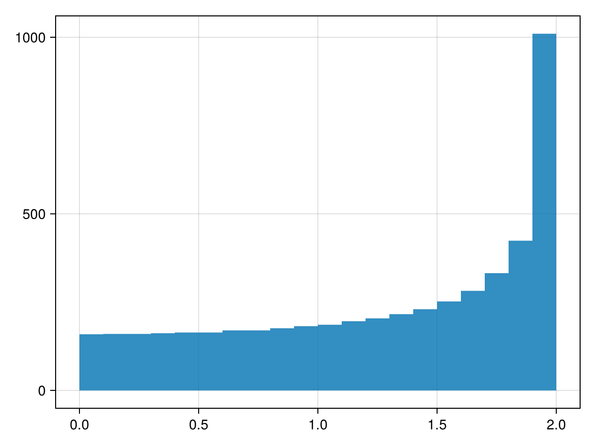
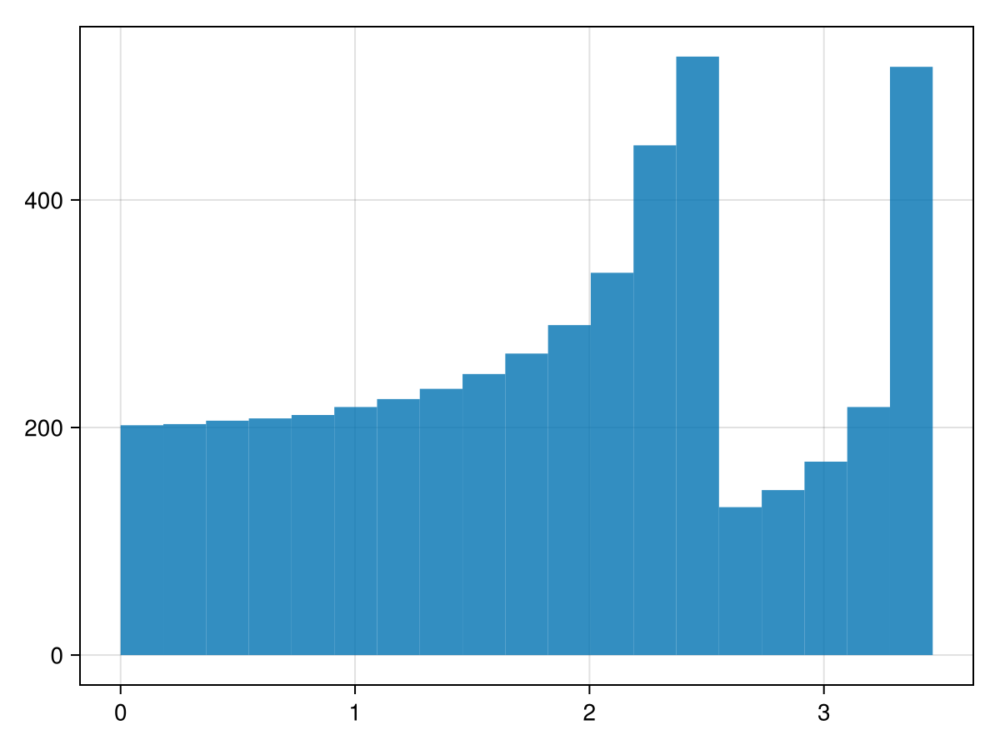

1.
```math
\text{(a) The condition number of}  \left(\begin{matrix}10^{10} & 0\\ 0 & 10^{-10}\end{matrix}\right) \text{is }10^{20},\text{ it is ill-conditioned.}\\

\text{(b) The condition number of}  \left(\begin{matrix}10^{10} & 0\\ 0 & 10^{10}\end{matrix}\right) \text{is }1,\text{ it is well-conditioned.}\\

\text{(c) The condition number of}  \left(\begin{matrix}10^{-10} & 0\\ 0 & 10^{-10}\end{matrix}\right) \text{is }1,\text{ it is well-conditioned.}\\

\text{(d) The condition number of} \left(\begin{matrix}1 & 2\\ 2 & 4\end{matrix}\right) \text{is }14.933034373659268,\text{ it is well-conditioned.}

```

2. Using the following julia code:
```julia
A = [2 1 -1 0 1;1 3 1 -1 0;0 1 4 1 -1;-1 0 1 3 1;1 -1 0 1 2];
b = [4,6,2,5,3];
sol = A\b
```
I get:
```julia-repl
sol = A\b
5-element Vector{Float64}:
 -0.04651162790697683
  2.186046511627907
  0.30232558139534904
  0.8139534883720929
  2.2093023255813957
```
that is 
```math
x_1 = -0.04651162790697683,\\
x_2 = 2.186046511627907,\\
x_3 = 0.30232558139534904,\\
x_4 = 0.8139534883720929,\\
x_5 = 2.2093023255813957.
```
3. Using the following code:
```julia
using LinearAlgebra
time = [0:1:31;]
y = [2374,2250,2113,2120,2098,2052,2057,2028,1934,1827,1765,1696,
1641,1594,1588,1612,1581,1591,1604,1587,1588,1600,1800,1640,1687,
1655,1786,1723,1523,1465,1200,1062]
A = hcat(ones(length(time)), time, time.^2,time.^3)
Q, R = qr(A)
a = R \ (Matrix(Q)' * y)
```
I get the coefficients of the ploynomial are:
```math
a_0 = 2451.5802139037455,\\
a_1 = -131.88430413372788,\\
a_2 = 7.6078894850487675,\\
a_3 = -0.14811528059499704.
```
For visualizing the result, the code is:
```julia
using Makie, CairoMakie
using Polynomials


time = [0:1:31;]
y = [2374,2250,2113,2120,2098,2052,2057,2028,1934,1827,1765,1696,
1641,1594,1588,1612,1581,1591,1604,1587,1588,1600,1800,1640,1687,
1655,1786,1723,1523,1465,1200,1062]


fig = Figure()
ax = Axis(fig[1, 1], xlabel="Time", ylabel="Population")
scatter!(ax, time.+1990, y, color=:blue, marker=:circle, markersize=20, label="Data")
 

poly = Polynomial(a)  
fitted_values = poly.(time)
lines!(ax, time.+1990, fitted_values, color=:red, label="Fitted Curve")
 

axislegend(; position=:lt)
fig  # Display figure
save("population_fit.png", fig)
```
and the figure is:

The predicted data of the newborn population for 2024 is:
```julia-repl
predict_value = poly(2024-1990)
940.7111295676092
```

4. I compute a spring chain with length 5000, the result for single species spring chain is:
, the code is:
```julia
using LinearAlgebra
using CairoMakie
M=1.0
C=1.0

L=5000
C_matrix = zeros(Float64,L,L)
for i in 1:L
    C_matrix[i,i]=-2*C
    if i == 1
        C_matrix[i,L]=C
        C_matrix[i,i+1] = C
    elseif i==L
        C_matrix[i,1]=C
        C_matrix[i,i-1] = C
    else
        C_matrix[i,i+1] = C
        C_matrix[i,i-1]=C
    end
    
end
evals,evecs = eigen(C_matrix)
evals = abs.(evals)
frequency = sqrt.(evals./M)
max_frequency = maximum(frequency)
min_frequency = minimum(frequency)
fig = hist(frequency,bins=range(min_frequency,max_frequency,length = 20))
save("density_single.png", fig)
```
For dual species spring chain, I use the code from ScientificComputingDeoms/SpringSystem:
```julia
using SpringSystem
using SpringSystem: eigenmodes, eigensystem, nv
using LinearAlgebra
using Graphs

C = 3.0 
L = 5000
M = [isodd(i) ? 1.0 : 2.0 for i in 1:L]
u0 = 0.2 * randn(L)
periodic = true

n = length(u0)
r = SpringSystem.Point.(0.0:n-1)
dr = SpringSystem.Point.(Float64.(u0))
v = fill(SpringSystem.Point(0.0), n)
topology = path_graph(n)
periodic && add_edge!(topology, n, 1)
#spring = spring_chain(u0, C, M; periodic=false)
spring = SpringModel(r, dr, v, topology, fill(C, n), M)
exact = eigenmodes(eigensystem(spring))
frequency = exact.frequency
max_frequency = maximum(frequency)
min_frequency = minimum(frequency)
fig = hist(frequency,bins=range(min_frequency,max_frequency,length = 20))
save("density_dual.png", fig)
```

and the result is:

