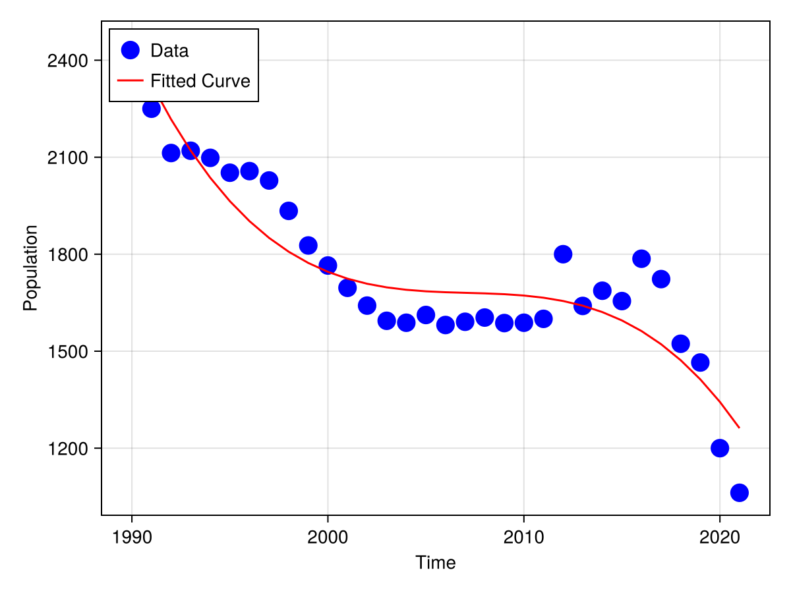

1.
```math
\text{(a) The condition number of}  \left(\begin{matrix}10^{10} & 0\\ 0 & 10^{-10}\end{matrix}\right) \text{is }10^{20},\text{ it is ill-conditioned.}\\

\text{(b) The condition number of}  \left(\begin{matrix}10^{10} & 0\\ 0 & 10^{10}\end{matrix}\right) \text{is }1,\text{ it is well-conditioned.}\\

\text{(c) The condition number of}  \left(\begin{matrix}10^{-10} & 0\\ 0 & 10^{-10}\end{matrix}\right) \text{is }1,\text{ it is well-conditioned.}\\

\text{(d) The condition number of} \left(\begin{matrix}1 & 2\\ 2 & 4\end{matrix}\right) \text{is }14.933034373659268,\text{ it is well-conditioned.}

```

2. Using the following julia code:
```julia
A = [2 1 -1 0 1;1 3 1 -1 0;0 1 4 1 -1;-1 0 1 3 1;1 -1 0 1 2];
b = [4,6,2,5,3];
sol = A\b
```
I get:
```julia-repl
sol = A\b
5-element Vector{Float64}:
 -0.04651162790697683
  2.186046511627907
  0.30232558139534904
  0.8139534883720929
  2.2093023255813957
```
that is 
```math
x_1 = -0.04651162790697683,\\
x_2 = 2.186046511627907,\\
x_3 = 0.30232558139534904,\\
x_4 = 0.8139534883720929,\\
x_5 = 2.2093023255813957.
```
3. Using the following code:
```julia
using LinearAlgebra
time = [0:1:31;]
y = [2374,2250,2113,2120,2098,2052,2057,2028,1934,1827,1765,1696,
1641,1594,1588,1612,1581,1591,1604,1587,1588,1600,1800,1640,1687,
1655,1786,1723,1523,1465,1200,1062]
A = hcat(ones(length(t)), t, t.^2)
Q, R = qr(A)
a = R \ (Matrix(Q)' * y)
```
I get the coefficients of the ploynomial are:
```math
a_0 = 2251.8467580213915,\\
a_1 = -47.82888239606695,\\
a_2 = 0.7205289373814038.
```
For visualizing the result, the code is:
```julia
using Makie, CairoMakie
using Polynomials


time = [0:1:31;]
y = [2374,2250,2113,2120,2098,2052,2057,2028,1934,1827,1765,1696,
1641,1594,1588,1612,1581,1591,1604,1587,1588,1600,1800,1640,1687,
1655,1786,1723,1523,1465,1200,1062]


fig = Figure()
ax = Axis(fig[1, 1], xlabel="Time", ylabel="Population")
scatter!(ax, time.+1990, y, color=:blue, marker=:circle, markersize=20, label="Data")
 

poly = Polynomial(a)  
fitted_values = poly.(time)
lines!(ax, time.+1990, fitted_values, color=:red, label="Fitted Curve")
 

axislegend(; position=:lt)
fig  # Display figure
save("population_fit.png", fig)
```
and the figure is:

The predicted data of the newborn population for 2024 is:
```julia-repl
predict_value = poly(2024-1990)
1458.596208168018
```
so it is approximately 1459×10⁴