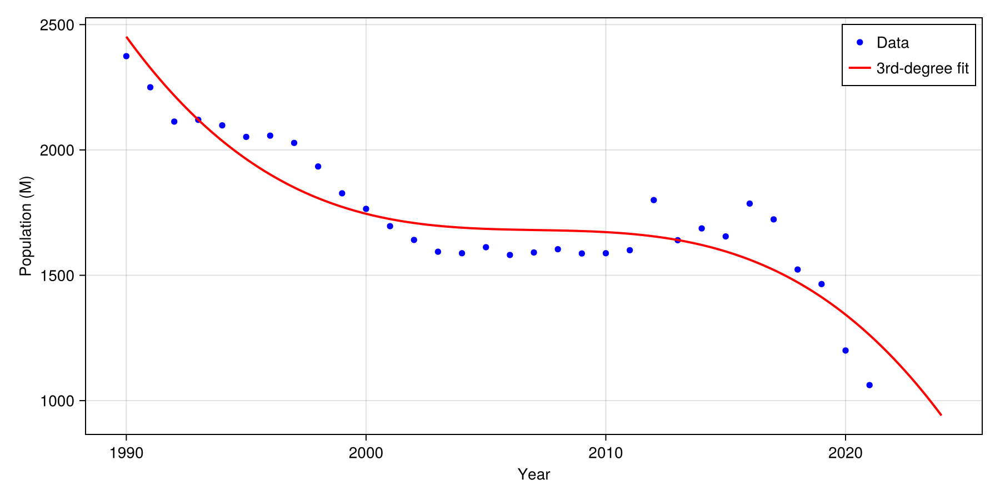

# Numerical Analysis Homework Solutions

## Problem 1

### Code and Results

```julia
using LinearAlgebra

A = [10e10 0; 0 10e-10]
B = [10e10 0; 0 10e10]
C = [10e-10 0; 0 10e-10]
D = [1 2; 2 4]

cond(A)
cond(B)
cond(C)
cond(D)

cond(D, 1)
cond(D, Inf)
cond(D, 2)
```

### Results

```julia
julia> cond(A)
1.0e20
julia> cond(B)
1.0
julia> cond(C)
1.0
julia> cond(D)
4.804857307547117e16
julia> cond(D, 1)
Inf
julia> cond(D, Inf)
Inf
julia> cond(D, 2)
4.804857307547117e16
```
So, (a) and (d) are ill-conditioned, while (b) and (c) are well-conditioned.


---

## Problem 2

### Given System

```julia
A = [  2  1 -1  0  1;
       1  3  1 -1  0;
       0  1  4  1 -1;
      -1  0  1  3  1;
       1 -1  0  1  2  ]

b = [4; 6; 2; 5; 3]
```

### Solution

```julia
x = A \ b
```

**Result:**
```
x = [-0.04651162790697683
      2.186046511627907
      0.30232558139534904
      0.8139534883720929
      2.2093023255813957]
```

### Verification

```julia
A * x
```

**Result:**
```
[4.0
 6.0
 2.0
 5.0
 3.000000000000001]
```

The verification shows that Ax ≈ b with negligible numerical error.

---

## Problem 3

### Methodology

To ensure numerical stability, we use QR decomposition instead of normal equations.

### Code

```julia
using CairoMakie, LinearAlgebra

years = collect(1990:2021)
pop = [2374, 2250, 2113, 2120, 2098, 2052, 2057, 2028, 1934, 1827, 
       1765, 1696, 1641, 1594, 1588, 1612, 1581, 1591, 1604, 1587, 
       1588, 1600, 1800, 1640, 1687, 1655, 1786, 1723, 1523, 1465, 
       1200, 1062]

x = Float64.(years .- 1990)

X = hcat(ones(length(x)), x, x.^2, x.^3)
y = Float64.(pop)

Q, R = qr(X)
coeffs = R \ (Matrix(Q)' * y)
a0, a1, a2, a3 = coeffs

predict = year -> begin
    t = float(year - 1990)
    a0 + a1*t + a2*t^2 + a3*t^3
end

pred2024 = predict(2024)

println("Coefficients (a0, a1, a2, a3) = ", coeffs)
println("Prediction for 2024 (millions) = ", pred2024)

xs = range(1990, stop=2024, length=500)
ys = predict.(xs)

fig = Figure(size=(900, 450))
ax = Axis(fig[1, 1], xlabel="Year", ylabel="Population (M)")
scatter!(ax, years, pop, color=:blue, markersize=8, label="Data")
lines!(ax, xs, ys, color=:red, linewidth=2, label="3rd-degree fit")
axislegend(ax; position=:rt)

save("population.png", fig)
```

### Results

```julia
coefficients (a0..a3) = [2451.580213903746, -131.8843041337281, 7.607889485048783, -0.14811528059499726]
prediction for 2024 (M) = 940.7111295676104
```

### Visualization

