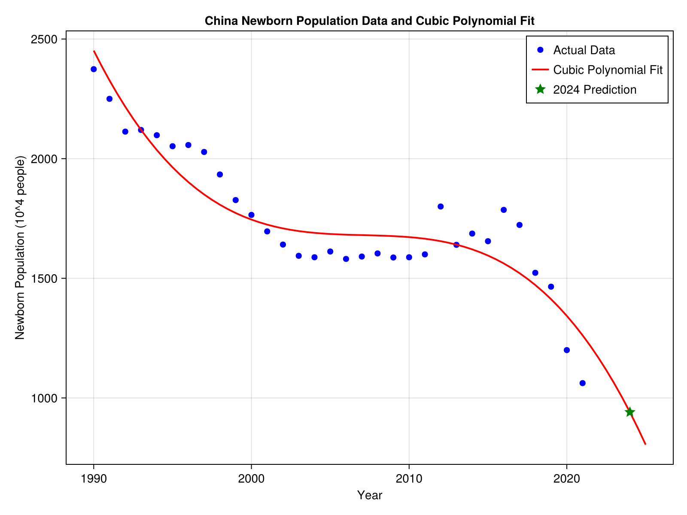
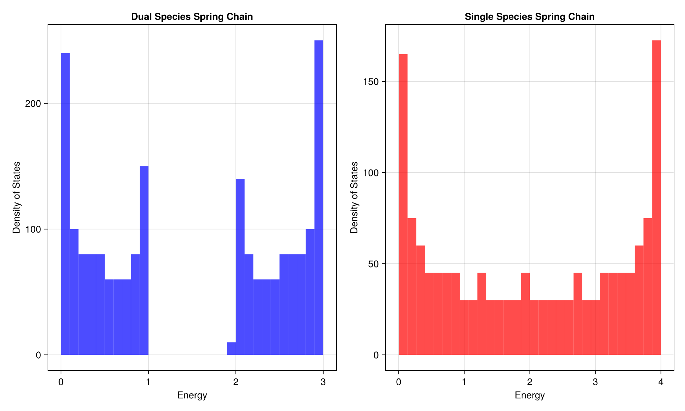
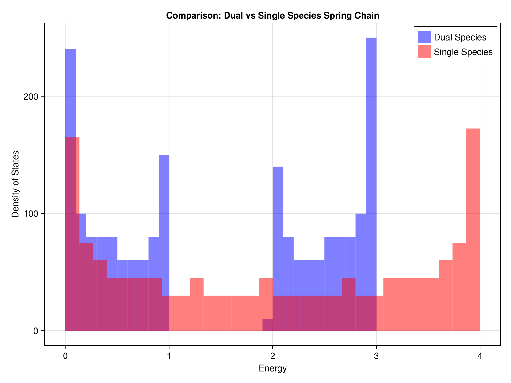

# Homework 4 Solutions

## Problem 1: Condition Number Analysis

By computing the condition numbers of each matrix and analyzing their conditioning:

### (a) Matrix $\begin{pmatrix}10^{10} & 0\\ 0 & 10^{-10}\end{pmatrix}$
- Condition number: $1.0 \times 10^{20}$
- Classification: **Ill-conditioned**

### (b) Matrix $\begin{pmatrix}10^{10} & 0\\ 0 & 10^{10}\end{pmatrix}$
- Condition number: $1.0$
- Classification: **Well-conditioned**

### (c) Matrix $\begin{pmatrix}10^{-10} & 0\\ 0 & 10^{-10}\end{pmatrix}$
- Condition number: $1.0$
- Classification: **Well-conditioned**

### (d) Matrix $\begin{pmatrix}1 & 2\\ 2 & 4\end{pmatrix}$
- Condition number: $4.8 \times 10^{16}$
- Classification: **Ill-conditioned**

## Problem 2: Solving Linear Equations

Given the system of linear equations:
```
2x₁ + x₂ - x₃ + 0x₄ + x₅ = 4
x₁ + 3x₂ + x₃ - x₄ + 0x₅ = 6
0x₁ + x₂ + 4x₃ + x₄ - x₅ = 2
-x₁ + 0x₂ + x₃ + 3x₄ + x₅ = 5
x₁ - x₂ + 0x₃ + x₄ + 2x₅ = 3
```

**Solution:**
- $x_1 = -0.04651162790697683$
- $x_2 = 2.186046511627907$
- $x_3 = 0.30232558139534904$
- $x_4 = 0.8139534883720929$
- $x_5 = 2.2093023255813957$

**Verification:** Residual 2-norm = $8.88 \times 10^{-16}$

## Problem 3: Polynomial Data Fitting

### Fitting Results
Cubic polynomial fit for China's newborn population (1990-2021):

$$y = 2451.58 - 131.88x + 7.61x^2 - 0.148x^3$$

where $x = \text{Year} - 1990$

### 2024 Prediction
For $x = 2024 - 1990 = 34$:

**Predicted newborn population for 2024: 940.7 × 10⁴ people**

### Visualization



- Blue circles: Actual data (1990-2021)
- Red curve: Cubic polynomial fit
- Green star: 2024 prediction

## Problem 4: Eigen-decomposition - Dual Species Spring Chain Analysis (Extra Points)

### Parameter Settings
- Number of sites: $N = 200$
- Spring constant: $C = 1$
- Mass distribution: Mass = 1 for even sites, Mass = 2 for odd sites
- Boundary condition: Periodic

### Analysis Results

#### Dual Species Spring Chain
- Number of eigenvalues: 199 (excluding one zero mode)
- Energy range: [0.000658, 3.000000]

#### Single Species Spring Chain (for comparison)
- Number of eigenvalues: 199 (excluding one zero mode)
- Energy range: [0.000987, 4.000000]

### Density of States Analysis






1. Dual species max energy (~3.0) < single species (~4.0)

2. Dual species: Complex structure with distinct peaks. Single species: Smoother, more uniform distribution

3. Periodic mass variation creates energy band structure similar to diatomic chains in solid state physics

### Conclusion
The dual species spring chain shows richer density of states features due to periodic mass distribution, relevant for condensed matter and phonon physics.

