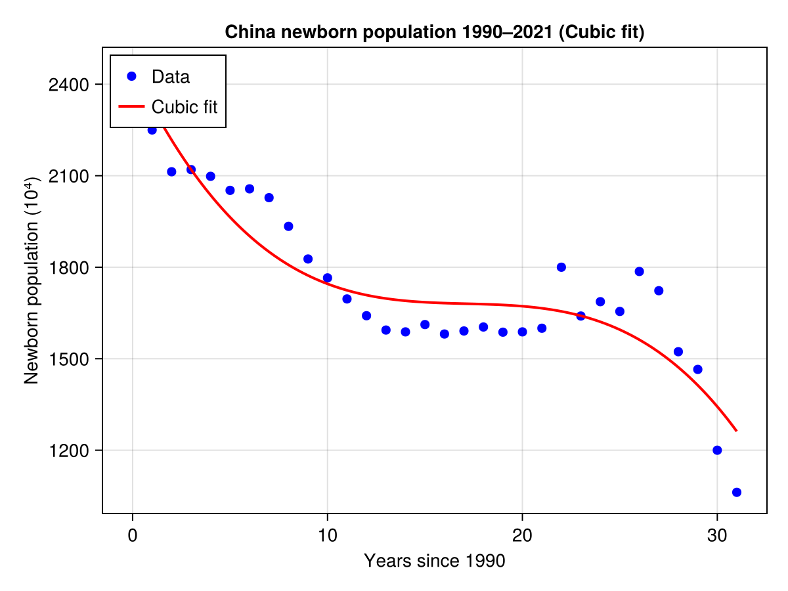
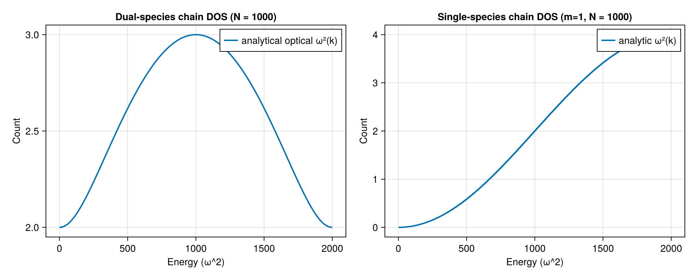

HW4
-----------------------------------------------------------------------------------
1.
A = [1e10 0; 0 1e-10]
B = [1e10 0; 0 1e10]
C = [1e-10 0; 0 1e-10]
D = [1 2; 2 4]

println("Matrix A condition number: ", cond(A))
println("Matrix B condition number: ", cond(B))
println("Matrix C condition number: ", cond(C))
println("Matrix D condition number: ", cond(D))

println("A: ", cond(A) > 1e12 ? "ill-conditioned" : "well-conditioned")
println("B: ", cond(B) > 1e12 ? "ill-conditioned" : "well-conditioned")
println("C: ", cond(C) > 1e12 ? "ill-conditioned" : "well-conditioned")
println("D: ", cond(D) > 1e12 ? "ill-conditioned" : "well-conditioned")

julia> println("A: ", cond(A) > 1e12 ? "ill-conditioned" : "well-conditioned")
A: ill-conditioned

julia> println("B: ", cond(B) > 1e12 ? "ill-conditioned" : "well-conditioned")
B: well-conditioned

julia> println("C: ", cond(C) > 1e12 ? "ill-conditioned" : "well-conditioned")
C: well-conditioned

julia> println("D: ", cond(D) > 1e12 ? "ill-conditioned" : "well-conditioned")
D: ill-conditioned

-----------------------------------------------------------------------------------
2.
using LinearAlgebra

A = [2  1 -1  0  1;
     1  3  1 -1  0;
     0  1  4  1 -1;
    -1  0  1  3  1;
     1 -1  0  1  2]

b = [4; 6; 2; 5; 3]

x = A \ b

println("Solution vector x:")
println("x1 = ", x[1])
println("x2 = ", x[2])
println("x3 = ", x[3])
println("x4 = ", x[4])
println("x5 = ", x[5])

julia> println("x1 = ", x[1])
x1 = -0.04651162790697683

julia> println("x2 = ", x[2])
x2 = 2.186046511627907

julia> println("x3 = ", x[3])
x3 = 0.30232558139534904

julia> println("x4 = ", x[4])
x4 = 0.8139534883720929

julia> println("x5 = ", x[5])

x5 = 2.2093023255813957
-----------------------------------------------------------------------------------
3.
using Polynomials, CairoMakie

years = [
    1990,1991,1992,1993,1994,1995,1996,1997,1998,1999,
    2000,2001,2002,2003,2004,2005,2006,2007,2008,2009,
    2010,2011,2012,2013,2014,2015,2016,2017,2018,2019,
    2020,2021
]

population = [
    2374,2250,2113,2120,2098,2052,2057,2028,1934,1827,
    1765,1696,1641,1594,1588,1612,1581,1591,1604,1587,
    1588,1600,1800,1640,1687,1655,1786,1723,1523,1465,
    1200,1062
]

x = years .- 1990
poly_fit = fit(x, population, 3)

x_fit = range(0, stop=maximum(x), length=200)
y_fit = poly_fit.(x_fit)

fig = Figure()
ax = Axis(fig[1, 1],
    xlabel = "Years since 1990",
    ylabel = "Newborn population (10⁴)",
    title = "China newborn population 1990–2021 (Cubic fit)"
)

scatter!(ax, x, population, color = :blue, marker = :circle, markersize = 10, label = "Data")
lines!(ax, x_fit, y_fit, color = :red, linewidth = 2, label = "Cubic fit")

axislegend(ax, position = :lt)
fig
save("china_population_fit.png", fig)

x_2024 = 2024 - 1990
y_2024 = poly_fit(x_2024)
println("\nPredicted 2024 newborn population ≈ $(round(y_2024, digits=2)) ×10⁴")

Predicted 2024 newborn population ≈ 940.71 ×10⁴

-----------------------------------------------------------------------------------
4.
using LinearAlgebra
using SparseArrays
using Polynomials  # not strictly needed but harmless
using CairoMakie
using Random
using Statistics
using Printf
using Dates

N = 1000                    # total number of sites (must be even)
@assert iseven(N) "Please choose even N"
C = 1.0                     # spring constant
m_even = 1.0                # mass on even sites
m_odd  = 2.0                # mass on odd sites

diags = Dict(0 => fill(2.0, N), 1 => fill(-1.0, N-1), -1 => fill(-1.0, N-1))
K = spdiagm(diags)

K[1, N] = -1.0
K[N, 1] = -1.0

# Mass matrix M 
mvec = zeros(Float64, N)
for i in 1:N
    # define odd index = 1,3,5,... to have mass m_odd
    mvec[i] = isodd(i) ? m_odd : m_even
end
M = spdiagm(0 => mvec)

#  K v = λ M v 
@time gev = eigen(Matrix(K), Matrix(M))   # convert to dense for eigen; works up to N~2000
λs = real(gev.values)                     # eigenvalues (ω^2)
# sort
sort!(λs)

M_single = spdiagm(0 => fill(1.0, N))
@time gev_single = eigen(Matrix(K), Matrix(M_single))
λs_single = real(gev_single.values)
sort!(λs_single)

# Use two-site unit cell: m1 (odd) = m_odd, m2 (even) = m_even, C=1.
# Brillouin zone k in [-π, π]. 
# ω^2(k) = C*(1/m1 + 1/m2) ± sqrt( C^2*(1/m1 + 1/m2)^2 - 4*C^2/(m1*m2) * sin^2(k/2) )
m1 = m_odd
m2 = m_even
ks = range(-π, π, length = 2000)
ω2_plus = Float64[]  # optical (higher)
ω2_minus = Float64[] # acoustic (lower)
for k in ks
    A = (1/m1 + 1/m2)
    B = 4/(m1*m2) * sin(k/2)^2
    # numeric safety: inside sqrt >=0
    Δ = A^2 - B
    Δ = max(Δ, 0.0)
    root = sqrt(Δ)
    push!(ω2_plus, A + root)
    push!(ω2_minus, A - root)
end

nbins = 120
minλ = 0.0
maxλ = maximum(vcat(λs, λs_single))*1.02

fig = Figure(resolution = (1000, 400))

# Left: dual-species DOS
ax1 = Axis(fig[1,1],
    xlabel = "Energy (ω^2)",
    ylabel = "Count",
    title = "Dual-species chain DOS (N = $(N))"
)
hist!(ax1, λs, bins = nbins, density = false)   # counts
lines!(ax1, ω2_minus, fillrange = nothing, linewidth = 2, label = "analytical acoustic ω²(k)")
lines!(ax1, ω2_plus,  linewidth = 2, label = "analytical optical ω²(k)")
axislegend(ax1, position = :rt)

ax2 = Axis(fig[1,2],
    xlabel = "Energy (ω^2)",
    ylabel = "Count",
    title = "Single-species chain DOS (m=1, N = $(N))"
)
hist!(ax2, λs_single, bins = nbins, density = false)
# analytic single-species ω^2(k) = 4/m * sin^2(k/2)  with m=1
ω2_single = 4.0 .* (sin.(ks ./ 2)).^2
lines!(ax2, sort(ω2_single), linewidth = 2, label = "analytic ω²(k)")
axislegend(ax2, position = :rt)

fig

save("dos_dual_vs_single.png", fig)
println("Saved figure to dos_dual_vs_single.png")

@printf("\nEigenvalue range (dual): min=%.6f, max=%.6f\n", minimum(λs), maximum(λs))
@printf("Eigenvalue range (single): min=%.6f, max=%.6f\n\n", minimum(λs_single), maximum(λs_single))

counts, edges = hist(λs, nbins, closed = :left)

