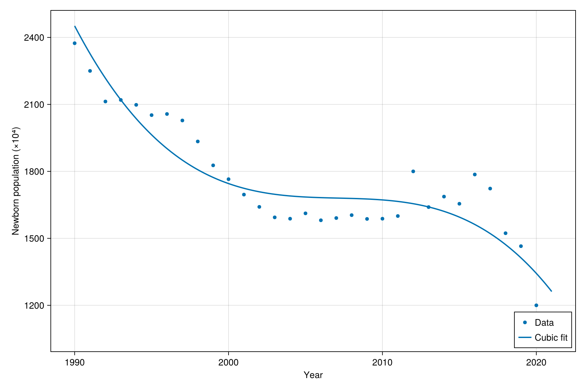
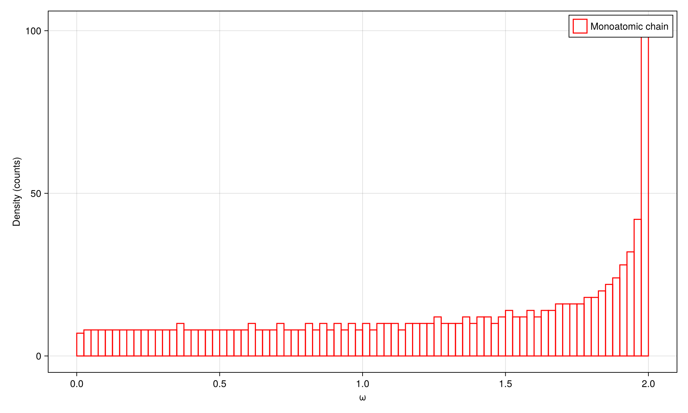

## **Problem 1 (Condition Number Analysis)** Classify each of the following matrices as well-conditioned or ill-conditioned by computing their condition numbers:

```math
\text{(a)} \quad \left(\begin{matrix}10^{10} & 0\\ 0 & 10^{-10}\end{matrix}\right)
```

```math
\text{(b)} \quad \left(\begin{matrix}10^{10} & 0\\ 0 & 10^{10}\end{matrix}\right)
```

```math
\text{(c)} \quad \left(\begin{matrix}10^{-10} & 0\\ 0 & 10^{-10}\end{matrix}\right)
```

```math
\text{(d)} \quad \left(\begin{matrix}1 & 2\\ 2 & 4\end{matrix}\right)
```
```julia
using LinearAlgebra

Aa = [1e10 0; 0 1e-10]
Ab = [1e10 0; 0 1e10]
Ac = [1e-10 0; 0 1e-10]
Ad = [1 2; 2 4]

cond(Aa), cond(Ab), cond(Ac), cond(Ad)
```

**Answer:**

| Matrix | Condition Number κ₂ | Interpretation                        |
| :----: | :-----------------: | :------------------------------------ |
|  `Aa`  |     **1.0×10²⁰**    | **ill-conditioned**          |
|  `Ab`  |       **1.0**       | **Well-conditioned**                  |
|  `Ac`  |       **1.0**       | **Well-conditioned**                  |
|  `Ad`  |  **≈ 4.8×10¹⁶ → ∞** | **ill-conditioned** |


---

## **Problem 2 (Solving Linear Equations)** Solve the following system of linear equations using Julia. Let $x_1, x_2, \ldots, x_5$ be real numbers:

```math
   \begin{align*}
   2x_1 + x_2 - x_3 + 0x_4 + x_5 &= 4, \\
   x_1 + 3x_2 + x_3 - x_4 + 0x_5 &= 6, \\
   0x_1 + x_2 + 4x_3 + x_4 - x_5 &= 2, \\
   -x_1 + 0x_2 + x_3 + 3x_4 + x_5 &= 5, \\
   x_1 - x_2 + 0x_3 + x_4 + 2x_5 &= 3.
   \end{align*}
```


```julia
using LinearAlgebra

A = [ 2  1 -1  0  1;
      1  3  1 -1  0;
      0  1  4  1 -1;
     -1  0  1  3  1;
      1 -1  0  1  2 ]

b = [4, 6, 2, 5, 3]

x  = A \ b                   # numerical solution
xr = (A .// 1) \ (b .// 1)   # exact rational solution
x, xr
```

**Answer:**

Numerical solution
$$
\mathbf{x}\approx
\begin{bmatrix}
-0.0465\\
2.1860\\
0.3023\\
0.8140\\
2.2093
\end{bmatrix}
$$

Exact rational form
$$
\boxed{
\mathbf{x}=
\begin{bmatrix}
-\tfrac{2}{43}\\
\tfrac{94}{43}\\
\tfrac{13}{43}\\
\tfrac{35}{43}\\
\tfrac{95}{43}
\end{bmatrix}
}
$$

---

## **Problem 3(Polynomial Data Fitting)** 

```julia
using Polynomials, CairoMakie

years = collect(1990:2021)
pop = [2374,2250,2113,2120,2098,2052,2057,2028,1934,1827,1765,1696,
       1641,1594,1588,1612,1581,1591,1604,1587,1588,1600,1800,1640,
       1687,1655,1786,1723,1523,1465,1200,1062]

t = years .- 1990
p = fit(t, pop, 3)
p_coeffs = coeffs(p)
pred_2024 = p(34.0)

fig = Figure(size=(900,600))
ax  = Axis(fig[1,1], xlabel="Year", ylabel="Newborn population (×10⁴)")
scatter!(ax, years, pop, markersize=8, label="Data")
tt = range(first(t), last(t), length=400)
lines!(ax, (tt .+ 1990), p.(tt), linewidth=2, label="Cubic fit")
axislegend(position=:rb)
save("population_fit.png", fig)
p, p_coeffs, pred_2024
```

**Answer:**

Fitted cubic polynomial
$$
\hat y(t)= 2451.5802 - 131.8843\, t + 7.607889\, t^2 - 0.1481153\, t^3
$$

Prediction for 2024 (t=34):
$$
\boxed{\hat y(2024)\approx 940.71\times 10^4 = 9.41\times 10^6}
$$



---

## **Problem 4(Extra points: Eigen-decomposition)** Solve the following problem:
Consider a dual species spring chain, with the number of sites as large as possible. The mass is 1 on even sites and 2 on odd sites, and stiffness constant is $C = 1$. The boundary condition is periodic.
- Show the density of states at different energy with binned bar plot. The $x$-axis is the energy, the $y$-axis is the population.
- Compare with the result of the single species spring chain.

Ref: the `hist` function in CairoMakie: https://docs.makie.org/dev/reference/plots/hist

```julia
using LinearAlgebra, SparseArrays, CairoMakie
using CairoMakie: RGBAf0

# ==== Parameters ====
N = 1000
C = 1.0
m_even, m_odd = 1.0, 2.0

# ==== Build stiffness matrix with periodic BC ====
main = fill(2C, N)
off  = fill(-C, N-1)
K = spdiagm(0 => main, 1 => off, -1 => off)
K[1,end] = -C
K[end,1] = -C

# ==== Alternating masses and normalization ====
m = [ (i % 2 == 0 ? m_even : m_odd) for i in 1:N ]
Dhalf_inv = Diagonal(1.0 ./ sqrt.(m))
Ktil = Dhalf_inv * K * Dhalf_inv

# ==== Eigen-decomposition ====
λ = eigen(Symmetric(Matrix(Ktil))).values
ω = sqrt.(clamp.(λ, 0, Inf))

# ==== Monoatomic comparison ====
λ1 = eigen(Symmetric(Matrix(K))).values
ω1 = sqrt.(clamp.(λ1, 0, Inf))

# ==== Plot DOS ====
fig = Figure(size=(1000,600))
ax  = Axis(fig[1,1], xlabel="ω", ylabel="Density (counts)")
hist!(ax, ω;  bins=80, normalization=:none, label="Diatomic chain",
      color=RGBAf0(0.2,0.4,0.9,0.35))
hist!(ax, ω1; bins=80, normalization=:none, label="Monoatomic chain",
      color=:transparent, strokecolor=:red, strokewidth=1.5)
axislegend(position=:rt)
save("dos_compare.png", fig)

(minimum(ω), maximum(ω)), (minimum(ω1), maximum(ω1))
```

**Answer:**

Comparison: Dual-species chain exhibits two separated energy bands (with a gap), while the single-species chain shows one continuous band.



---