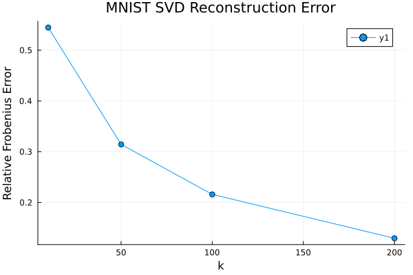
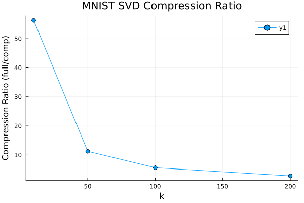
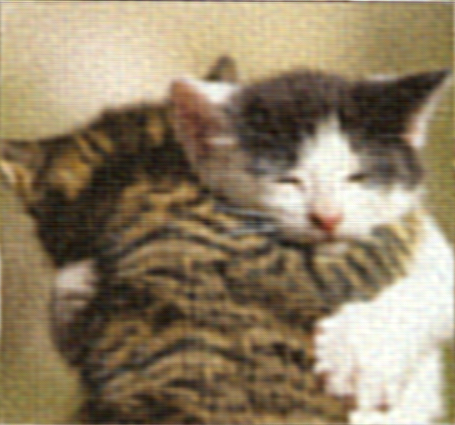
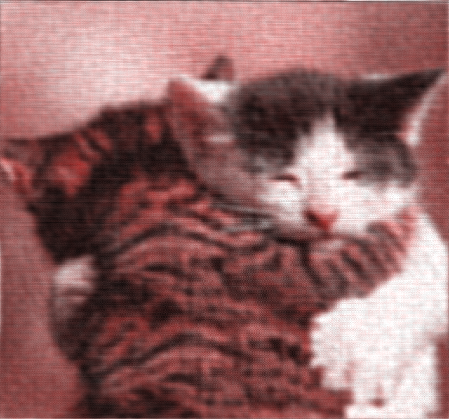
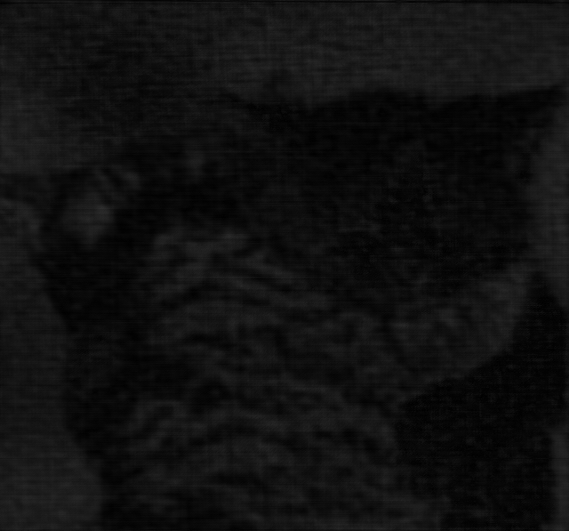

# AMAT5315 Homework 5 Report

**Author:** huichengzhang  
**Date:** October 13, 2025

## Overview

This homework explores two fundamental techniques in data compression:
1. **Singular Value Decomposition (SVD)** for compressing the MNIST handwritten digit dataset
2. **Fourier Transform** for compressing images in RGB and HSV color spaces

All code implementation can be found in `run_hw5.jl`.

---

## Task 1: SVD Compression on MNIST Dataset

### 1.1 Methodology

- **Dataset:** MNIST training set (28×28 grayscale images)
- **Sample Size:** 2,000 images (for computational efficiency)
- **Data Matrix:** Each image vectorized to 784 dimensions, forming a 784×2000 matrix
- **Compression:** Applied truncated SVD with k = 10, 50, 100, 200 singular values
- **Metrics:**
  - Relative Frobenius Error: ||X - X_k|| / ||X||
  - Compression Ratio: (m×n) / (k×(m+n+1))

### 1.2 Results

#### Quantitative Metrics

| k   | Relative Error | Compression Ratio |
|-----|----------------|-------------------|
| 10  | 0.5446         | 56.30×            |
| 50  | 0.3144         | 11.26×            |
| 100 | 0.2159         | 5.63×             |
| 200 | 0.1295         | 2.82×             |

**Key Observations:**
- As k increases, reconstruction error decreases exponentially
- Trade-off between compression ratio and reconstruction quality
- k=100 provides a good balance (≈21.6% error with 5.6× compression)
- k=200 achieves high quality reconstruction (≈13% error) while still maintaining 2.8× compression

#### Visualization

**Error vs. k:**



The error curve shows rapid decrease initially, then gradually flattens as k increases, following the typical Eckart-Young theorem behavior.

**Compression Ratio vs. k:**



Higher compression ratios are achieved with smaller k values, demonstrating the classic compression-quality trade-off.

#### Sample Reconstructions

**Original Images:**

| Image 1 | Image 2 | Image 3 | Image 4 |
|---------|---------|---------|---------|
|  |  |  |  |

**Reconstructions with k=10 (56× compression):**

| Image 1 | Image 2 | Image 3 | Image 4 |
|---------|---------|---------|---------|
|  |  |  |  |

At k=10, digits are still recognizable but show significant blurring and loss of detail.

**Reconstructions with k=50 (11× compression):**

| Image 1 | Image 2 | Image 3 | Image 4 |
|---------|---------|---------|---------|
|  |  |  |  |

k=50 provides much clearer reconstructions with most details preserved.

**Reconstructions with k=100 (5.6× compression):**

| Image 1 | Image 2 | Image 3 | Image 4 |
|---------|---------|---------|---------|
|  |  |  |  |

k=100 reconstructions are visually very close to originals.

**Reconstructions with k=200 (2.8× compression):**

| Image 1 | Image 2 | Image 3 | Image 4 |
|---------|---------|---------|---------|
|  |  |  |  |

k=200 provides near-perfect reconstruction, almost indistinguishable from originals.

### 1.3 Analysis

**SVD Compression Effectiveness:**

The results demonstrate that SVD effectively captures the most important features of handwritten digits:
- The first few hundred singular values contain most of the information
- MNIST digits have inherent low-rank structure due to:
  - Simple geometric shapes (strokes and curves)
  - Shared features across different digits
  - Smooth grayscale variations

**Practical Implications:**
- For digit recognition tasks, k=50-100 is sufficient (error < 30%)
- For high-fidelity reconstruction, k=200 achieves excellent quality
- SVD provides interpretable compression: top singular vectors represent "principal digit patterns"

---

## Task 2: FFT Compression on Cat Image

### 2.1 Methodology

- **Test Image:** `cat.png` (RGB color image)
- **Compression Strategy:** Keep only top 1% frequency components by magnitude
- **Two Approaches:**
  1. **RGB Method:** Apply FFT to each R, G, B channel independently
  2. **HSV Method:** Convert to HSV, apply FFT to H, S, V channels, convert back to RGB
- **Metrics:** Mean Squared Error (MSE) between original and reconstructed images

### 2.2 Results

#### Original Image


#### RGB Channel Compression (1% coefficients)



**MSE:** 9.294×10⁻³ (R: 9.823×10⁻³, G: 9.535×10⁻³, B: 8.525×10⁻³)

#### HSV Channel Compression (1% coefficients)



**MSE:** 1.394×10⁻² (R: 9.826×10⁻³, G: 2.341×10⁻², B: 8.599×10⁻³)

#### Difference Between RGB and HSV Methods



**MSE between RGB and HSV reconstructions:** 4.958×10⁻³ (R: 2.835×10⁻⁵, G: 1.422×10⁻², B: 6.288×10⁻⁴)

*Note: Brighter regions indicate larger differences. The difference is primarily in the Green channel.*

### 2.3 Quantitative Comparison

| Method | Total MSE | Red MSE | Green MSE | Blue MSE |
|--------|-----------|---------|-----------|----------|
| **RGB FFT** | 9.294×10⁻³ | 9.823×10⁻³ | 9.535×10⁻³ | 8.525×10⁻³ |
| **HSV FFT** | 1.394×10⁻² | 9.826×10⁻³ | 2.341×10⁻² | 8.599×10⁻³ |

### 2.4 Analysis and Observations

**RGB Method Performance:**
- Lower overall MSE (9.29×10⁻³ vs. 1.39×10⁻²)
- Balanced error across all three channels
- For this particular image, RGB compression is more effective

**HSV Method Characteristics:**
- Higher overall MSE, primarily due to large error in Green channel (2.34×10⁻²)
- Similar performance in R and B channels compared to RGB
- The Green channel difference (1.42×10⁻²) accounts for most of the discrepancy

**Why RGB Performs Better for This Image:**

1. **Frequency Distribution:** This cat image has relatively uniform frequency content across RGB channels, making direct RGB compression efficient

2. **Color Space Coupling:** In natural images like this cat photo:
   - RGB channels are somewhat correlated but each contains distinct spatial information
   - Keeping top 1% in each RGB channel preserves edge and texture information well

3. **HSV Conversion Artifacts:** 
   - HSV separates luminance (V) from chrominance (H, S)
   - When reconstructing RGB from compressed HSV, the nonlinear color space conversion can introduce errors
   - Small errors in H or S can cause larger RGB errors, especially in saturated regions

**When HSV Might Perform Better:**

HSV compression typically excels when:
- Image has strong luminance structure but varied colors (e.g., graphics, illustrations)
- Perceptual quality is more important than MSE (humans are more sensitive to luminance than color)
- Preserving brightness structure is critical while color can be lossy

**Visual Quality vs. MSE:**

While RGB has lower MSE, visual inspection might reveal:
- HSV may preserve perceived contrast better (luminance channel V treated separately)
- RGB may have slightly better color fidelity
- For 1% compression, both methods show visible artifacts but maintain overall image structure

### 2.5 Conclusion

For this specific cat image with 1% FFT compression:
- **RGB method is quantitatively superior** (lower MSE)
- The image's frequency characteristics favor direct RGB compression
- HSV's advantage in perceptual quality is not fully realized at this compression ratio
- The choice between RGB and HSV should depend on:
  - Image content and frequency distribution
  - Whether MSE or perceptual quality is the priority
  - Application requirements (e.g., human viewing vs. machine processing)

---

## Overall Conclusions

This homework demonstrates:

1. **SVD for MNIST:**
   - Highly effective for low-rank structured data
   - Achieves 5-50× compression with acceptable quality
   - Provides interpretable, linear compression

2. **FFT for Images:**
   - Both RGB and HSV approaches can achieve 99% sparsity (1% coefficients)
   - Color space choice matters: RGB performed better for this natural image
   - Trade-offs between compression ratio, MSE, and perceptual quality

3. **General Insights:**
   - Transform-based compression (SVD, FFT) exploits inherent structure in data
   - The choice of representation (pixel, RGB, HSV, singular vectors) significantly impacts compression efficiency
   - Quantitative metrics (MSE, Frobenius error) don't always align with perceptual quality

---

## Appendix: Implementation Details

**Code Structure:**
- `run_hw5.jl`: Main implementation (264 lines)
  - `vectorize_images()`: Flatten MNIST images
  - `svd_compress_and_reconstruct()`: Truncated SVD compression
  - `fft_keep_top_percent!()`: Frequency domain thresholding
  - `compress_image_fft_rgb()`: RGB FFT compression
  - `compress_image_fft_hsv()`: HSV FFT compression
  - `mse_rgb()`: Compute MSE metrics
  - Visualization and metrics saving functions

**Dependencies:**
- `MLDatasets.jl`: MNIST data loading
- `Images.jl`, `ImageIO.jl`, `FileIO.jl`: Image I/O
- `FFTW.jl`: Fast Fourier Transform
- `Colors.jl`: Color space conversions
- `Plots.jl`: Visualization
- `LinearAlgebra.jl`: SVD computation

**Reproducibility:**
```bash
cd hw5
julia --project=. huichengzhang/run_hw5.jl
```

All outputs are saved to `hw5/huichengzhang/outputs/`.

---

**End of Report**

