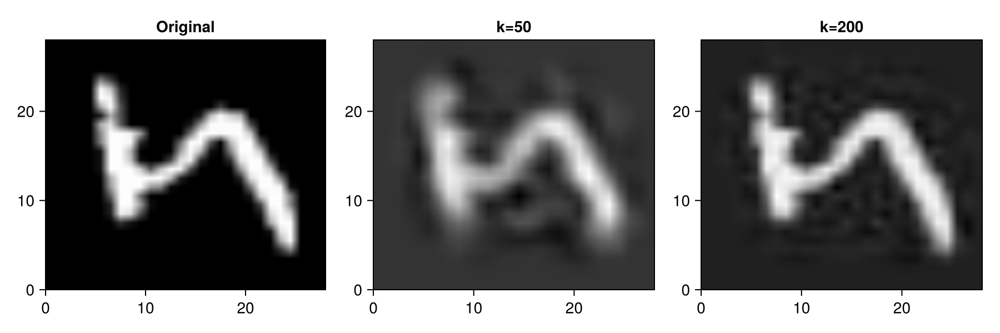
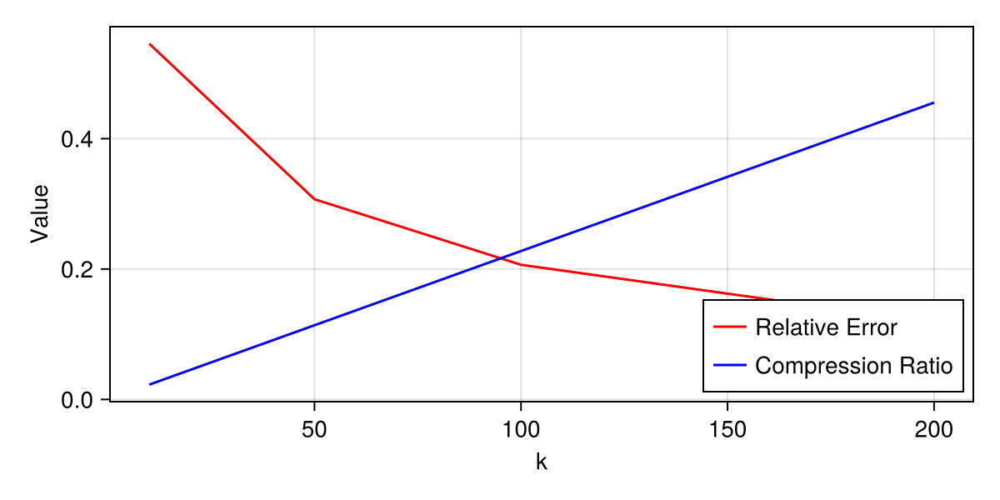
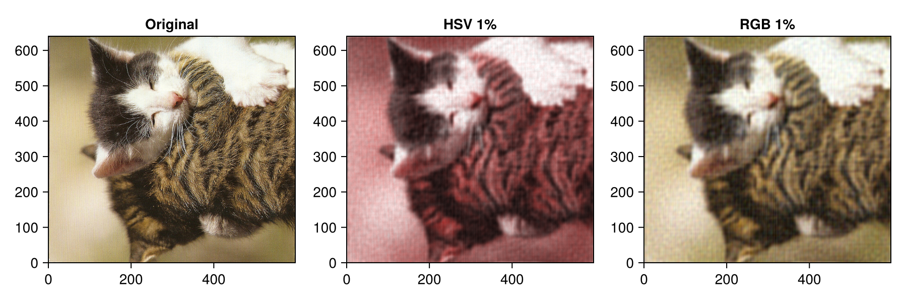

## **Task 1 — SVD Compression of MNIST**
### **Code**

```julia
include("download_mnist.jl")
using MLDatasets, LinearAlgebra, CairoMakie

# 1. Load MNIST training data
train_images, train_labels = download_mnist(:train)

# 2. Reshape into 2D data matrix
X = reshape(train_images, 28*28, :)
Xsample = X[:, 1:1000]  # sample subset

# 3. Compute SVD
svdres = svd(Xsample; full=false)
U, S, Vt = svdres.U, svdres.S, svdres.Vt

# 4. Reconstruction and compression analysis
reconstruct(U, S, Vt, k) = U[:, 1:k] * Diagonal(S[1:k]) * Vt[1:k, :]
fro(A) = norm(A)
m, n = size(Xsample)
ks = [10, 50, 100, 200]
errors = Float64[]
ratios = Float64[]
den = fro(Xsample)

for k in ks
    Xk = reconstruct(U, S, Vt, k)
    push!(errors, fro(Xsample - Xk) / den)
    push!(ratios, (k * (m + n + 1)) / (m * n))
end

@show errors ratios
```

---

### **Results**

| k   | Relative Error | Compression Ratio |
| --- | -------------- | ----------------- |
| 10  | **0.546**      | **0.0228**        |
| 50  | **0.307**      | **0.1138**        |
| 100 | **0.206**      | **0.2277**        |
| 200 | **0.118**      | **0.4554**        |

---

### **Visualization**

**Reconstructed images (original, k=50, k=200):**



**Error and compression ratio vs k:**



---

## **Task 2 — Fourier Transform Compression on cat.png**

### **Code**

```julia
using Images, FileIO, FFTW, Colors, ImageTransformations, Statistics, CairoMakie

img = load("cat.png")
img_rgb = RGB.(img)

# Compression function
function compress_fft_channel(A; keep_ratio=0.01)
    A64 = float.(A)
    F   = fftshift(fft(A64))
    mag = abs.(F)
    thr = quantile(vec(mag), 1 - keep_ratio)
    mask = mag .>= thr
    Ff = F .* mask
    real.(ifft(ifftshift(Ff)))
end

# RGB compression
rgb_ch = channelview(img_rgb)
rec_rgb_ch = similar(rgb_ch, Float64)
for i in 1:3
    rec_rgb_ch[i, :, :] = compress_fft_channel(rgb_ch[i, :, :]; keep_ratio=0.01)
end
rec_rgb = colorview(RGB, clamp.(rec_rgb_ch, 0, 1))

# HSV compression (converted back to RGB for display)
img_hsv = HSV.(img_rgb)
hsv_ch = channelview(img_hsv)
rec_hsv_ch = similar(hsv_ch, Float64)
for i in 1:3
    rec_hsv_ch[i, :, :] = compress_fft_channel(hsv_ch[i, :, :]; keep_ratio=0.01)
end
rec_hsv = colorview(HSV, clamp.(rec_hsv_ch, 0, 1))
rec_hsv_rgb = RGB.(rec_hsv)

# Visualization
fig = CairoMakie.Figure(size=(900, 300))
ax1 = CairoMakie.Axis(fig[1,1], title="Original")
ax2 = CairoMakie.Axis(fig[1,2], title="HSV 1%")
ax3 = CairoMakie.Axis(fig[1,3], title="RGB 1%")
CairoMakie.image!(ax1, img_rgb)
CairoMakie.image!(ax2, rec_hsv_rgb)
CairoMakie.image!(ax3, rec_rgb)
CairoMakie.save("cat_fft_compare.png", fig)
display(fig)
```

---

### **Result**



---

### **Observation**

* The **HSV-compressed** image appears **red-tinted and more blurred**, because small errors in the hue channel cause noticeable color distortion.
* The **RGB-compressed** version maintains **original color tones** and comparable sharpness, showing that direct RGB compression is visually more stable.

---
