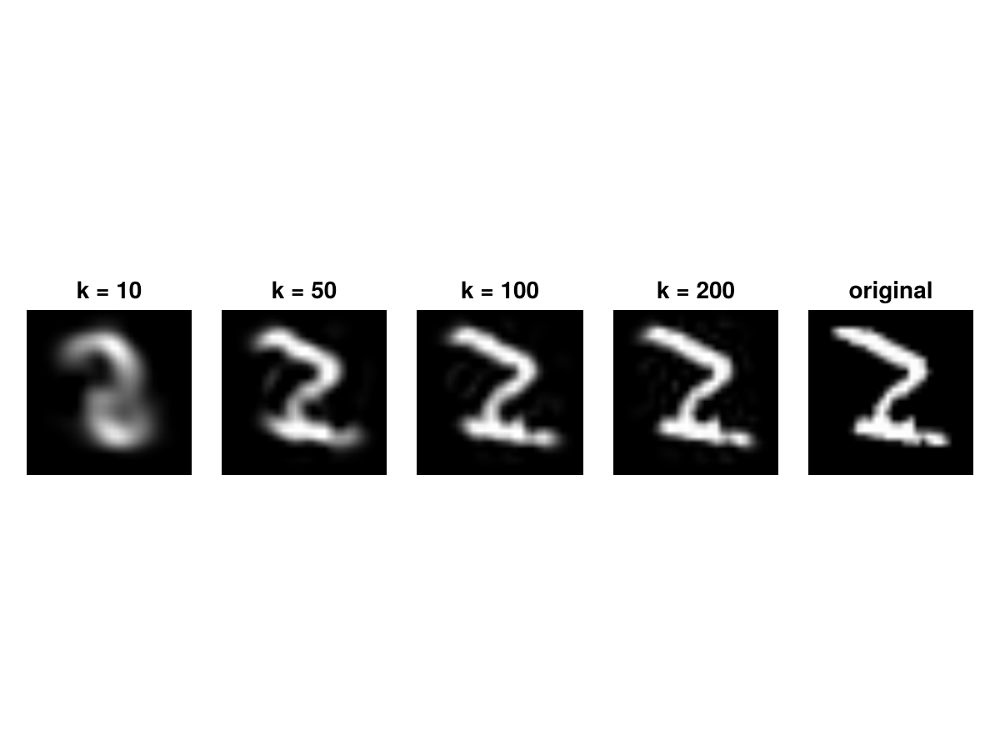
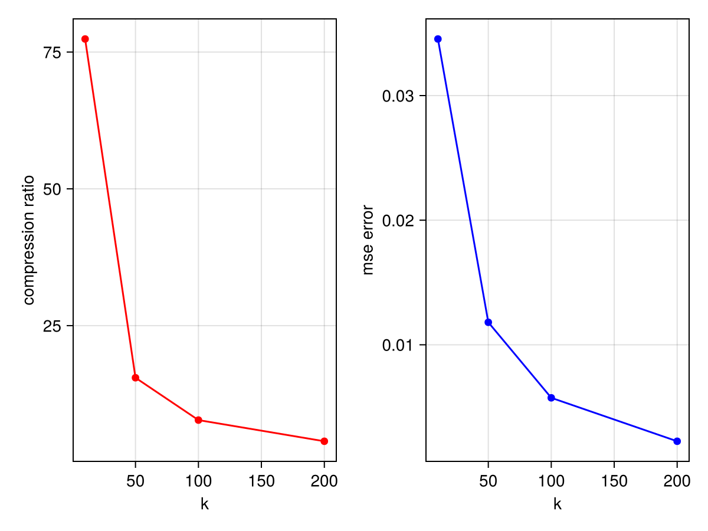
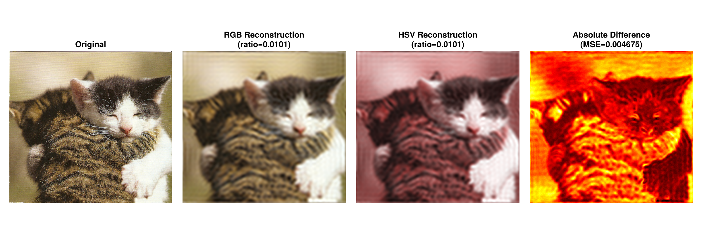

# Homework 5

**Note:** Submit your solutions in either `.md` (Markdown) or `.jl` (Julia) format.

1. **(Singular Value Decomposition for Image Compression)** Use singular value decomposition to compress the MNIST dataset. 

**Results:**

2. **(Image Processing with Fourier Transform)** Based on the ["cat" image](cat.png) that we used in class, perform the following analysis:
   - Compress the image with Fourier transformation in HSV channel (check [this youtube video](https://www.youtube.com/watch?app=desktop&v=DGojI9xcCfg)). Keep only the most significant 1% components (by magnitude) in the Fourier space, and then reconstruct the image.
   - Repeat the same process in the RGB channel, and compare the two reconstructed images. How much are they different? explain the observation.

**Results:**

The experiment demonstrates that RGB is more robust than HSV for frequency-domain compression (Fourier Transform). Here are the key points:

Color Distortion: At a 1% compression ratio, the HSV reconstruction shows significant color shifting (the pinkish tint), while the RGB reconstruction maintains better color fidelity.

Hue Sensitivity: In the HSV model, the Hue (H) channel is circular and non-linear. Small errors in the Fourier domain can cause drastic changes in color (e.g., red jumping to purple) during the inverse transform.

Linearity vs. Non-linearity: RGB channels vary linearly with intensity, making them more suitable for the additive nature of Fourier components. HSV is better for color detection but performs poorly for aggressive signal reconstruction.

Conclusion: For frequency-based compression, RGB (or YCbCr) is preferred over HSV to avoid unpredictable color artifacts.