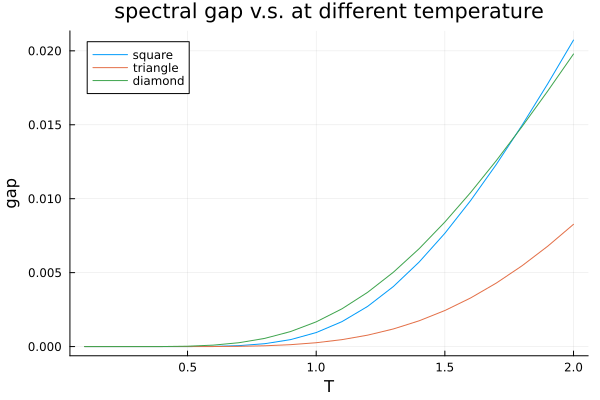
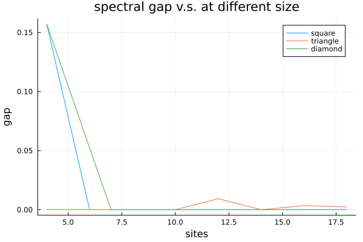

# Homework 7
1. I use the following code:
```julia
fullerene_graph = UnitDiskGraph(fullerene(), sqrt(5)); # construct the unit disk graph

spin_glass = SpinGlass(
            fullerene_graph,   # graph
           ones(Int, ne(fullerene_graph)),     # J, in order of edges
           zeros(Int, nv(fullerene_graph))     # h, in order of vertices
       )


tempscales = collect(10 .- (1:64 .- 1) .* 0.15)
gs_energy,_ = annealing(20,spin_glass,tempscales,4000)
@show gs_energy
```
the whole codes are in "HongkuanXia/hw7_1.jl", using the simulated annealing, I get the ground state energy is -66.

2.
I use the code in hw7_2.jl, and the first question, I have the following result:

and for second question, it is:
