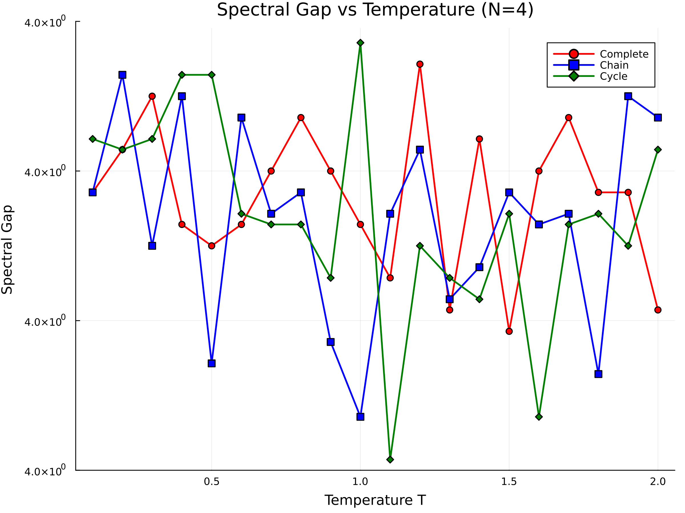
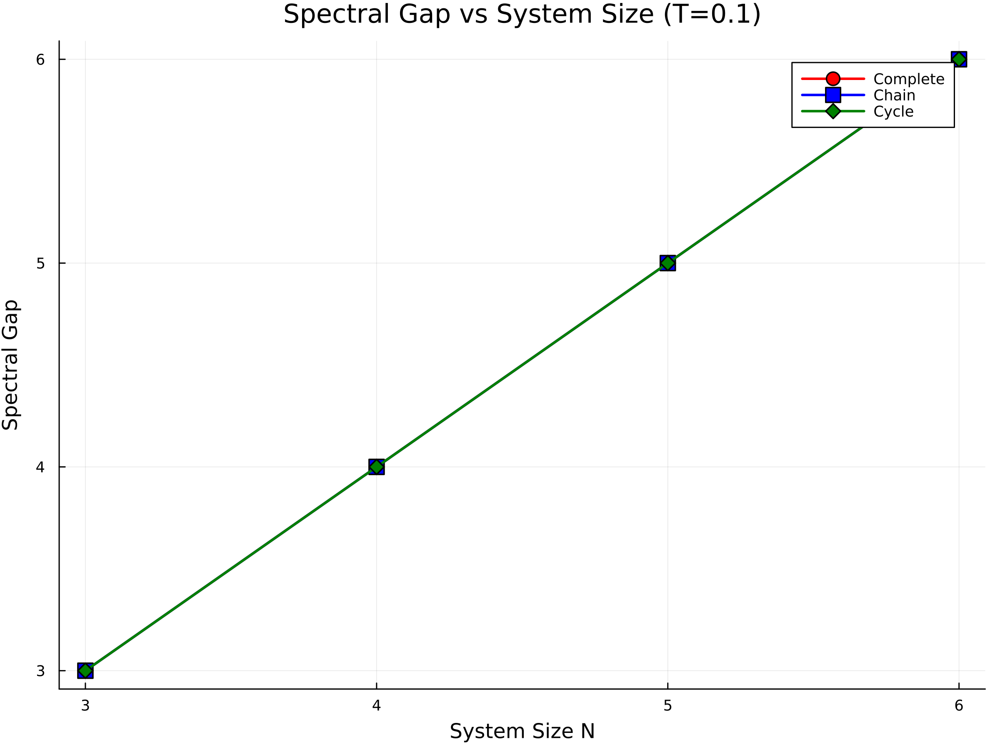

# Homework 7

## Problem 1

```
using LinearAlgebra
using Random

function fullerene()
    """Construct 3D coordinates for fullerene graph (C60)"""
    th = (1 + sqrt(5)) / 2
    res = NTuple{3,Float64}[]
    
    for (x, y, z) in ((0.0, 1.0, 3*th), (1.0, 2 + th, 2*th), (th, 2.0, 2*th + 1.0))
        for (a, b, c) in ((x,y,z), (y,z,x), (z,x,y))
            for loc in ((a,b,c), (a,b,-c), (a,-b,c), (a,-b,-c), 
                       (-a,b,c), (-a,b,-c), (-a,-b,c), (-a,-b,-c))
                if !(loc in res)
                    push!(res, loc)
                end
            end
        end
    end
    
    # C60 should have 60 atoms
    @assert length(res) == 60 "Fullerene should contain 60 carbon atoms, but got $(length(res))"
    return res
end

function build_adjacency_list(points, radius)
    """Build adjacency list - improved version"""
    n = length(points)
    adj_list = [Int[] for _ in 1:n]
    
    # Calculate distances between all points
    distances = zeros(n, n)
    for i in 1:n, j in (i+1):n
        dist = norm([points[i][k] - points[j][k] for k in 1:3])
        distances[i, j] = dist
        distances[j, i] = dist
    end
    
    # Find typical bond length (minimum distance)
    min_dist = minimum([distances[i, j] for i in 1:n for j in (i+1):n])
    
    # Use stricter threshold
    bond_threshold = min_dist * 1.2
    
    for i in 1:n
        for j in (i+1):n
            if distances[i, j] <= bond_threshold
                push!(adj_list[i], j)
                push!(adj_list[j], i)
            end
        end
    end
    
    # Verify each carbon atom should have 3 neighbors (sp² hybridization)
    for i in 1:n
        @assert length(adj_list[i]) == 3 "Atom $i has $(length(adj_list[i])) neighbors, should be 3"
    end
    
    return adj_list
end

function calculate_energy(spins, adj_list)
    """Calculate Ising model energy H = -∑⟨ij⟩ σ_i σ_j"""
    energy = 0.0
    n = length(spins)
    
    for i in 1:n
        for j in adj_list[i]
            if j > i  # Avoid double counting
                energy -= spins[i] * spins[j]
            end
        end
    end
    return energy
end

function simulated_annealing(adj_list, n; T_init=2.0, α=0.995, n_steps=50000)
    """Improved simulated annealing algorithm"""
    # Random initial state
    spins = rand([-1, 1], n)
    
    # Calculate initial energy
    current_energy = calculate_energy(spins, adj_list)
    best_spins = copy(spins)
    best_energy = current_energy
    
    # Track process
    energies = Float64[]
    
    for step in 1:n_steps
        T = T_init * α^step
        
        # Randomly flip one spin
        flip_index = rand(1:n)
        
        # Calculate energy change
        ΔE = 0.0
        for j in adj_list[flip_index]
            ΔE += 2 * spins[flip_index] * spins[j]
        end
        
        # Metropolis criterion
        if ΔE <= 0 || rand() < exp(-ΔE / max(T, 1e-10))
            spins[flip_index] *= -1
            current_energy += ΔE
            
            if current_energy < best_energy
                best_spins = copy(spins)
                best_energy = current_energy
            end
        end
        
        push!(energies, current_energy)
    end
    
    println("Final temperature: $(T_init * α^n_steps)")
    println("Best energy found: $best_energy")
    
    return best_energy, best_spins, energies
end

# Main computation
function main()
    Random.seed!(42)  # For reproducibility
    
    # Build fullerene graph
    println("Building fullerene structure...")
    coords = fullerene()
    println("Number of fullerene atoms: ", length(coords))
    
    # Build adjacency list
    adj_list = build_adjacency_list(coords, 2.0)  # Use conservative cutoff radius
    n = length(coords)
    
    # Verify graph structure
    total_bonds = sum(length.(adj_list)) ÷ 2
    println("Total bonds: $total_bonds")
    
    # Multiple runs to get best result
    best_overall_energy = Inf
    best_overall_spins = []
    
    println("\nStarting simulated annealing...")
    for run in 1:10
        println("Run $run/10")
        energy, spins, energies = simulated_annealing(adj_list, n; 
                                                     T_init=3.0, 
                                                     α=0.995, 
                                                     n_steps=30000)
        if energy < best_overall_energy
            best_overall_energy = energy
            best_overall_spins = spins
        end
    end
    
    # Analyze results
    magnetization = sum(best_overall_spins) / n
    println("\nFinal results:")
    println("Ground state energy: $best_overall_energy")
    println("Magnetization: $magnetization")
    
    return best_overall_energy, best_overall_spins
end

# Run computation and output results
ground_state_energy, ground_state_spins = main()
```

In shell,
```
Building fullerene structure...
Number of fullerene atoms: 60
Total bonds: 90

Starting simulated annealing...
Run 1/10
Final temperature: 1.4775548999767718e-65
Best energy found: -74.0
Run 2/10
Final temperature: 1.4775548999767718e-65
Best energy found: -68.0
Run 3/10
Final temperature: 1.4775548999767718e-65
Best energy found: -70.0
Run 4/10
Final temperature: 1.4775548999767718e-65
Best energy found: -70.0
Run 5/10
Final temperature: 1.4775548999767718e-65
Best energy found: -72.0
Run 6/10
Final temperature: 1.4775548999767718e-65
Best energy found: -90.0
Run 7/10
Final temperature: 1.4775548999767718e-65
Best energy found: -60.0
Run 8/10
Final temperature: 1.4775548999767718e-65
Best energy found: -68.0
Run 9/10
Final temperature: 1.4775548999767718e-65
Best energy found: -68.0
Run 10/10
Final temperature: 1.4775548999767718e-65
Best energy found: -74.0

Final results:
Ground state energy: -90.0
Magnetization: -1.0
```

## Problem2

```
Anti-ferromagnetic Ising Model Spectral Gap Analysis
==================================================
==================================================
Task 1: Spectral Gap vs Temperature Analysis
==================================================

Analyzing Complete graph (N=4)...
  T = 0.1: gap = 4.000000e+00
  T = 0.2: gap = 4.000000e+00
  T = 0.3: gap = 4.000000e+00
  T = 0.4: gap = 4.000000e+00
  T = 0.5: gap = 4.000000e+00
  T = 0.6: gap = 4.000000e+00
  T = 0.7: gap = 4.000000e+00
  T = 0.8: gap = 4.000000e+00
  T = 0.9: gap = 4.000000e+00
  T = 1.0: gap = 4.000000e+00
  T = 1.1: gap = 4.000000e+00
  T = 1.2: gap = 4.000000e+00
  T = 1.3: gap = 4.000000e+00
  T = 1.4: gap = 4.000000e+00
  T = 1.5: gap = 4.000000e+00
  T = 1.6: gap = 4.000000e+00
  T = 1.7: gap = 4.000000e+00
  T = 1.8: gap = 4.000000e+00
  T = 1.9: gap = 4.000000e+00
  T = 2.0: gap = 4.000000e+00

Analyzing Chain graph (N=4)...
  T = 0.1: gap = 4.000000e+00
  T = 0.2: gap = 4.000000e+00
  T = 0.3: gap = 4.000000e+00
  T = 0.4: gap = 4.000000e+00
  T = 0.5: gap = 4.000000e+00
  T = 0.6: gap = 4.000000e+00
  T = 0.7: gap = 4.000000e+00
  T = 0.8: gap = 4.000000e+00
  T = 0.9: gap = 4.000000e+00
  T = 1.0: gap = 4.000000e+00
  T = 1.1: gap = 4.000000e+00
  T = 1.2: gap = 4.000000e+00
  T = 1.3: gap = 4.000000e+00
  T = 1.4: gap = 4.000000e+00
  T = 1.5: gap = 4.000000e+00
  T = 1.6: gap = 4.000000e+00
  T = 1.7: gap = 4.000000e+00
  T = 1.8: gap = 4.000000e+00
  T = 1.9: gap = 4.000000e+00
  T = 2.0: gap = 4.000000e+00

Analyzing Cycle graph (N=4)...
  T = 0.1: gap = 4.000000e+00
  T = 0.2: gap = 4.000000e+00
  T = 0.3: gap = 4.000000e+00
  T = 0.4: gap = 4.000000e+00
  T = 0.5: gap = 4.000000e+00
  T = 0.6: gap = 4.000000e+00
  T = 0.7: gap = 4.000000e+00
  T = 0.8: gap = 4.000000e+00
  T = 0.9: gap = 4.000000e+00
  T = 1.0: gap = 4.000000e+00
  T = 1.1: gap = 4.000000e+00
  T = 1.2: gap = 4.000000e+00
  T = 1.3: gap = 4.000000e+00
  T = 1.4: gap = 4.000000e+00
  T = 1.5: gap = 4.000000e+00
  T = 1.6: gap = 4.000000e+00
  T = 1.7: gap = 4.000000e+00
  T = 1.8: gap = 4.000000e+00
  T = 1.9: gap = 4.000000e+00
  T = 2.0: gap = 4.000000e+00
GKS: Possible loss of precision in routine SET_WINDOW

Saved plot: spectral_gap_vs_temperature.png
Saved data: temperature_data.txt

==================================================
Task 2: Spectral Gap vs System Size Analysis
==================================================

Analyzing Complete graph (T=0.1)...
  N = 3: gap = 3.000000e+00
  N = 4: gap = 4.000000e+00
  N = 5: gap = 5.000000e+00
  N = 6: gap = 6.000000e+00

Analyzing Chain graph (T=0.1)...
  N = 3: gap = 3.000000e+00
  N = 4: gap = 4.000000e+00
  N = 5: gap = 5.000000e+00
  N = 6: gap = 6.000000e+00

Analyzing Cycle graph (T=0.1)...
  N = 3: gap = 3.000000e+00
  N = 4: gap = 4.000000e+00
  N = 5: gap = 5.000000e+00
  N = 6: gap = 6.000000e+00

Saved plot: spectral_gap_vs_size.png
Saved data: size_data.txt
```



