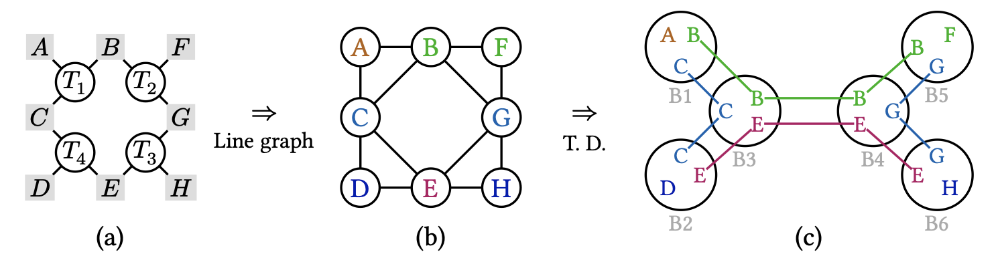

# Homework 8
1.
- ij,kj->ik
- ij->
- ij,ij,ij->ij
- ij,kl,mn-> ijklmn

2.
Using the tree decomposition, i.e.

The tree decomposition in (c) consists of 6 bags, each containing at most 3 indices, indicating that
the treewidth of the tensor network is 2. The tensors $T_1$, $T_2$, $T_3$ and $T_4$ are contained in bags $B_1$, $B_5$,
$B_6$ and $B_2$ respectively. Following the tree structure, we perform the contraction from the leaves.
First, we contract bags $B_1$ and $B_2$ into $B_3$, yielding an intermediate tensor $I_{14} = T_1 ∗ T_4$ (where “∗
”denotes tensor contraction) with indices $B$ and $E$. Next, we contract bags $B_5$ and $B_6$ into $B_4$,
producing another intermediate tensor $I_{23} = T_2 ∗ T_3$ also with indices $B$ and $E$. Finally, contracting
$B_3$ and $B_4$ yields the desired scalar result.

3.