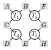
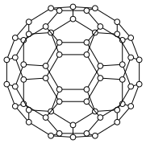

## Modified from hw8/longlizheng

1. (Einsum notation) Write the einsum notation for the following operations:
    - Matrix multiplication with transpose: $C = A B^T$
    - Summing over all elements in a matrix: $\sum_{i,j} A_{i,j}$
    - Multiplying three matrices element-wise: $D = A \odot B \odot C$
    - Kronecker product: $D = A \otimes B \otimes C$
  
    Ans:
    - `ein"ik, jk -> ij"(A, B)`
    - `ein"ij ->"(A)`
    - `ein"ij, ij, ij -> ij"(A, B, C)`
    - `ein"ij, kl, mn -> ikmjln"(A, B, C)`, or `reshape(ein"ij, kl, mn -> ikmjln"(A, B, C), size(A, 1) * size(B, 1) * size(C, 1), :)`
  
    Tips:
    - Index order in Kronecker product

2. (Contraction order) What is the optimal contraction order for the following tensor network?
  
  where $T_i$ are tensors, $A - H$ are indices.

    Ans:
    ```julia
    julia> using OMEinsum

    julia> code = ein"abc, fbg, dce, hge -> afdh"
    abc, fbg, dce, hge -> afdh

    julia> optcode = optimize_code(code, uniformsize(code, 2), TreeSA())
    abde, hefb -> afdh
    ├─ abc, dce -> abde
    │  ├─ abc
    │  └─ dce
    └─ hge, fbg -> hefb
        ├─ hge
        └─ fbg
    ```
    Tips:
    - ```OMEinsum.optimize_code``` with ```TreeSA()``` optimizer

3. (Partition function) Compute the partition function $Z$ for the AFM (anti-ferromagnetic) Ising model on the Fullerene graph. Please scan the inverse temperature $\beta$ from $0.1$ to $2.0$ with step $0.1$. For the information needed to construct the Fullerene graph, please refer to Homework 7.
  

    See ```hw8.jl```

    Tips:
    - For a certain configuration $\vec{\sigma}\in \{-1,1\}^n$, energy $ H(\vec{\sigma}) = \sum_{(i,j)}\sigma_i \sigma_j $
    - Partition function $$
    Z\equiv \sum_{\vec{\sigma}} e^{-\beta H(\vec{\sigma})}\\
    = \sum_{\vec{\sigma}}e^{-\beta \sum_{(i,j)}\sigma_i \sigma_j}\\
    =\sum_{\vec{\sigma}}\prod_{(i,j)} e^{-\beta \sigma_i \sigma_j}\\
    =\sum_{\vec{\sigma}}\prod_{(i,j)} h_{\sigma_i, \sigma_j}
    $$ Summation over all possible configurations $\leftrightarrow$ Regarding $\vec{\sigma}$ as indices and contract all local rank-2 tensors $$
    \begin{align*}
    e^{-\beta \sigma_i \sigma_j} &= \begin{bmatrix}
    h_{\sigma_i=-1, \sigma_j=-1} &h_{\sigma_i=-1, \sigma_j=1}\\
    h_{\sigma_i=1, \sigma_j=-1} &h_{\sigma_i=1, \sigma_j=1}
    \end{bmatrix} \\
    &=\begin{bmatrix}
    e^{-\beta} &e^{\beta}\\
    e^{\beta} &e^{-\beta}
    \end{bmatrix}
    \end{align*}
    $$