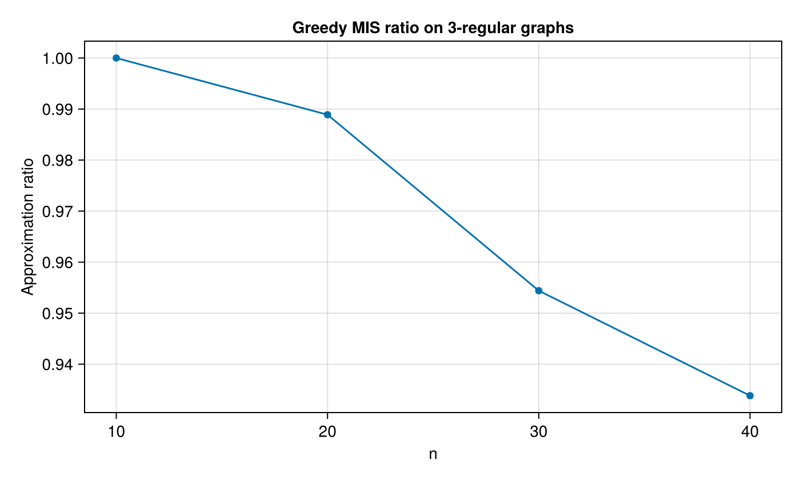

# Homework 9

1. **(Computational Complexity)** Reduce the following circuit SAT (half adder) to a spin glass ground state problem.

   

Answer: 
```julia
using ProblemReductions

half_adder = @circuit begin
    s = a ∨ b
    c = a ∧ b
end
sat = CircuitSAT(half_adder)

reduce_path = reduction_paths(CircuitSAT, SpinGlass)
sg = reduceto(reduce_path[1], sat)
```

2. **(Spin Dynamics)** Use the spin dynamics simulation to find the ground state of the above spin glass problem. Fix the output is $S=0, C=1$, and read out the input spin configuration.

Answer:
The greedy spin-dynamics (zero-temperature local updates) is implemented in `hw9.jl` and run on the constrained spin-glass instance. The recovered input is:
`a = 1`, `b = 1` (i.e., `true, true`).
```
[ Info: Fixed outputs: s=false, c=true
[ Info: Recovered inputs: a=true, b=true
```

3. **(Greedy Algorithm)** Implement the greedy algorithm for solving the maximum independent set problem. Generate random 3-regular graphs at different sizes (e.g. $n=10, 20, 30, 40, 50,...,200$), and show the scaling of approximation ratio. Can this algorithm maintain the same approximation ratio?

Answer:
The greedy local-search algorithm is implemented in `hw9.jl`. The approximation ratio typically decreases as $n$ grows, so the algorithm does **not** maintain a constant ratio in practice on random 3-regular graphs.

